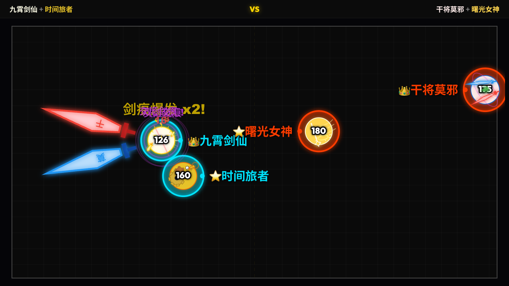
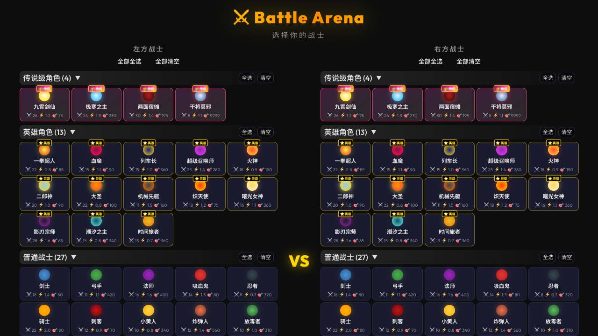
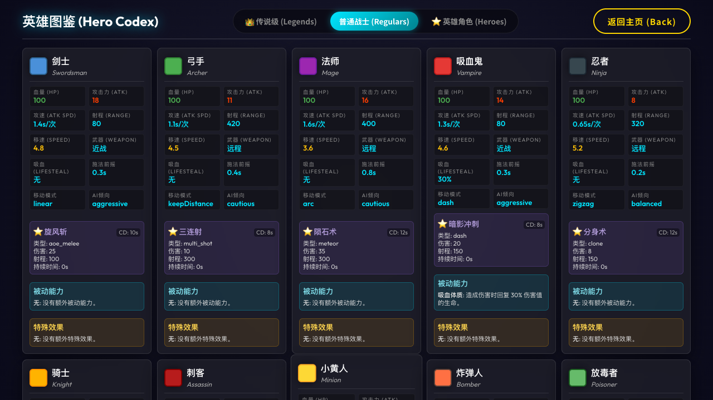
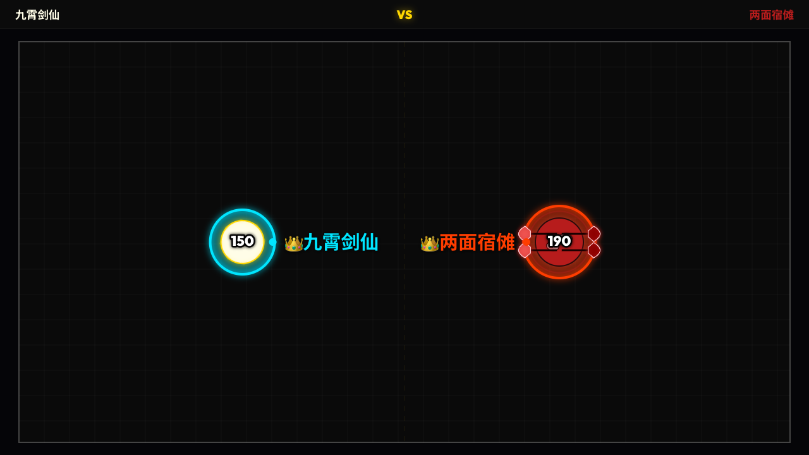
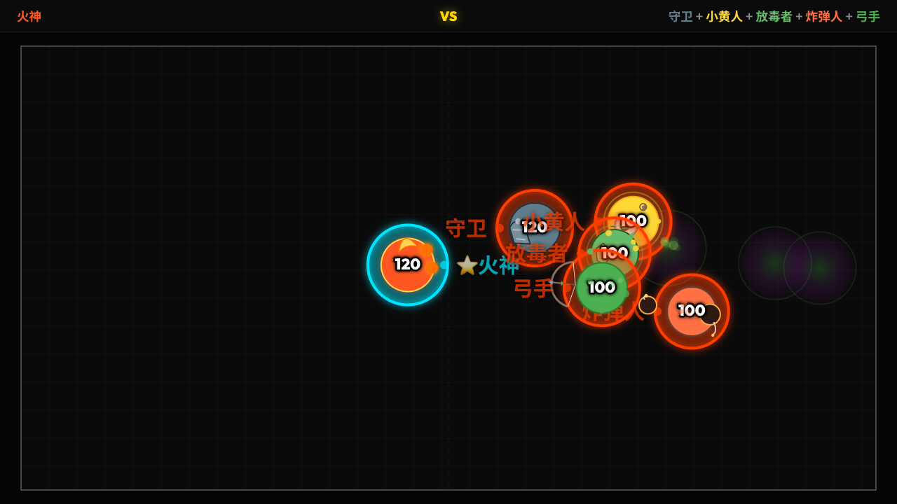
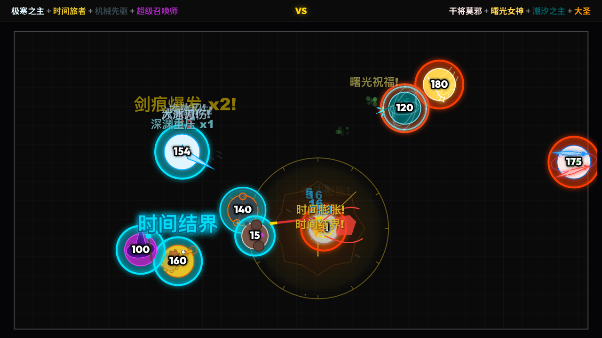

# Battle Arena

一款纯前端 2D 自动战斗竞技场。选择两支队伍，把战士丢进同一张战场，然后看剑气、毒雾、召唤物、时间结界和天火爆燃一起把局面推向失控。

它不需要后端、不需要数据库，也不需要复杂构建流程。打开网页，选人，开战。

试玩地址：[http://8.162.8.124:8080](http://8.162.8.124:8080)



## 为什么值得玩

- **49 个可选/可召唤单位**：普通战士、英雄角色、传说级单位和召唤物都在同一套数据驱动系统里。
- **自动战斗但不无聊**：角色会自动索敌、移动、普攻、释放技能，战斗结果来自阵容、站位、技能机制和混战中的连锁反应。
- **技能机制很丰富**：吸血、眩晕、减速、灼烧、中毒、复活、召唤、穿刺、时间场、剑阵、范围爆炸等机制都已经接入。
- **英雄图鉴可读性强**：每个角色都有属性、技能、被动能力和特殊效果说明，适合边玩边研究阵容。
- **纯静态项目**：HTML、CSS、JavaScript 原生实现，方便本地运行、分享和部署到 GitHub Pages / Vercel。

## 游戏截图

### 角色选择

左右双方都可以自由选择角色，也可以一键全选，直接开启大乱斗。



### 英雄图鉴

图鉴按普通战士、英雄角色、传说级角色分组，适合快速查看属性、技能、被动和特殊机制。



### 战斗实况

战斗发生在 Canvas 中，角色、投射物、范围效果、伤害数字和生命条都会实时刷新。


### 更多对局瞬间

**一对一：传说级单挑**

九霄剑仙对阵两面宿傩，适合观察高机动突进、无敌帧、连段和斩击特效。



**一对多：火神压场**

火神单挑小队时，灼烧、扇形火焰和连锁爆燃会把战场变成持续扩散的火场。



**实时混战：控制、召唤与范围技能叠加**

极寒之主、时间旅者、机械先驱和超级召唤师对阵干将莫邪、曙光女神、潮汐之主和大圣，能看到控制场、召唤物、治疗复活和穿刺剑气在同一局里互相碰撞。



## 特色角色

**九霄剑仙 / Celestial Sword Deity**  
传说级近战核心。普攻会打出剑波、范围眩晕和连续穿刺，飞剑环绕带来攻速与移速成长；濒死时还能化为金色剑意免死滑行。主动技能「诛仙剑阵」会把战场变成一片剑雨。

**极寒之主 / Frost Lord**  
传说级控场角色。冰盾让单次非灼烧伤害被压低，受击后反放冰刃；普攻会先砸下冰山，再化为冰杖穿到低血敌人身后。主动技能「极寒之地」能制造吸入敌人的封锁领域。

**干将莫邪 / Gan Jiang Mo Ye**  
传说级双剑角色。普通攻击从身体两侧发射红蓝巨剑，追踪、穿刺并留下交汇剑痕；受到伤害时有机会无敌穿身，濒死时还能靠双剑续命反打。

**火神 / Vulcan**  
英雄级范围爆发。普通攻击改为扇形放火，点燃敌人后持续扣血；「天火爆燃」会引爆所有着火目标和周围区域，一旦敌人站得太密，局面会瞬间炸开。

**时间旅者 / Time Traveler**  
英雄级节奏控制。能让友军或自己在致命伤害时倒流回 3 秒前状态；时间结界会加速友方、迟滞敌方，把战斗从拼数值变成拼窗口期。

**机械先驱 / Mecha Pioneer**  
英雄级火力平台。两只浮游子机会持续自动射击，低血时展开电磁护盾；主动技能「重力力场」适合在多人混战里聚怪和打断阵型。

## 快速开始

推荐用本地静态服务器运行，避免浏览器对 `file://` 的模块加载限制。

```bash
python3 -m http.server 8080
```

然后打开：

```text
http://localhost:8080
```

如果只是快速试一下，也可以直接打开 `index.html`。一旦遇到白屏或模块加载失败，就改用上面的本地服务器方式。

## 玩法

1. 在首页为左方和右方选择角色。
2. 可调整战场尺寸，适配宽屏、竖屏或自定义画布。
3. 点击开始战斗。
4. 进入战斗后可调节倍速、缩放和视角。
5. 战斗结束后可以复战，或者回到选择界面换阵容。

## 项目结构

```text
.
├── index.html              # 游戏入口
├── css/
│   └── style.css           # 页面和战斗 UI 样式
├── js/
│   ├── main.js             # 页面入口和交互绑定
│   ├── combat.js           # 战斗编排
│   ├── fighter.js          # 战斗单位核心行为
│   ├── characters/         # 角色数据与外观绘制
│   ├── skills/             # 技能注册与技能实现
│   ├── projectiles/        # 投射物类型
│   ├── combat/             # 战斗辅助模块
│   └── rendering/          # 角色渲染模块
├── docs/
│   └── screenshots/        # README 截图
└── DEPLOYMENT.md           # 部署与迁移说明
```

## 添加新角色

角色采用数据驱动方式扩展。新增角色通常需要：

1. 在 `js/characters/` 下新增角色数据文件。
2. 在 `js/characters/index.js` 注册角色。
3. 如需新技能类型，在 `js/skills/` 中添加技能实现并注册。
4. 为角色补充 `passives` 和 `specialEffects`，让图鉴说明完整。

更详细的流程见 [添加角色示例.md](./添加角色示例.md)。

## 部署

这是纯静态项目，适合直接部署到：

- GitHub Pages
- Vercel
- 任意 Nginx / Apache / 静态文件服务器
- 一台能运行 `python3 -m http.server` 的电脑

完整迁移和部署步骤见 [DEPLOYMENT.md](./DEPLOYMENT.md)。

## 技术栈

- 原生 HTML / CSS / JavaScript
- ES Modules
- Canvas 2D 渲染
- Web Audio API
- 无后端、无数据库、无打包要求

## 开发提示

这个项目适合继续扩展成更完整的自动战斗实验场：

- 添加更多英雄和传说级单位
- 加入阵容预设和战斗回放
- 记录胜率、战斗日志和伤害统计
- 增加地图机制、装备系统或关卡模式

如果你喜欢看角色机制互相碰撞，这里已经有一块很适合继续加料的战场。
