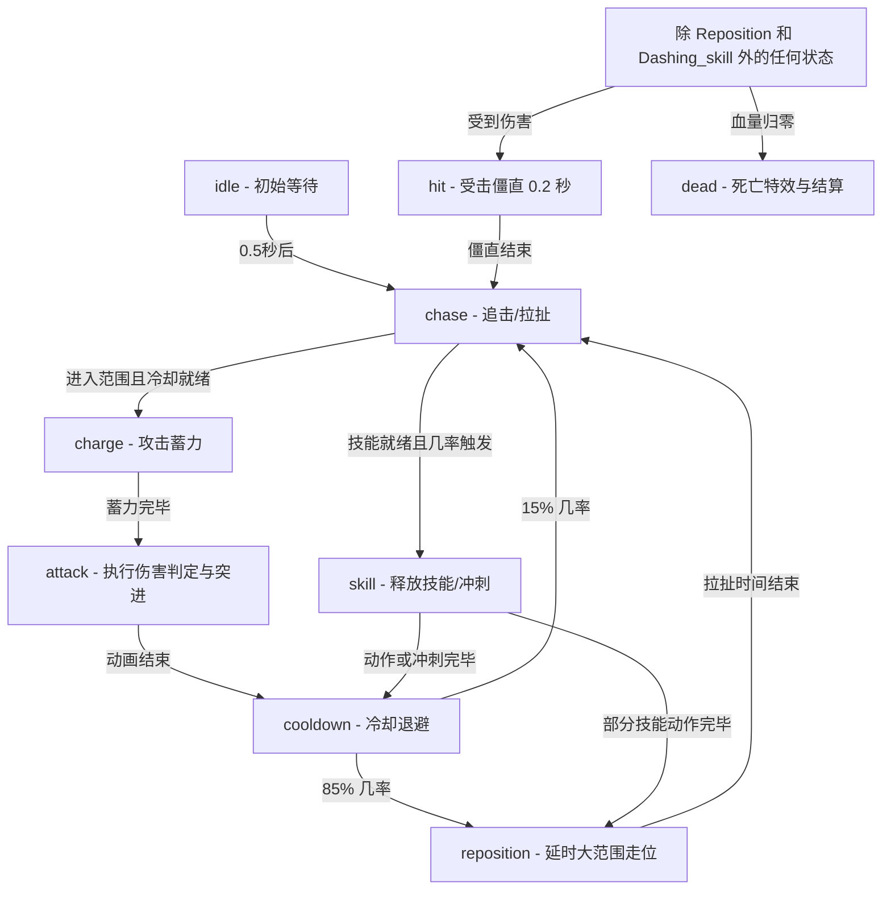

# 2D Auto-Battler Arena (2D 智能自走格斗竞技场)

这是一个基于 HTML5 Canvas 和纯原生 CSS/JS 构建的高视觉表现力、全自动 2D 格斗模拟系统。您可以从 8 位属性平衡但技能与 AI 倾向各异的角色中自由选择两位进行对决，系统将自动控制角色进行极具视觉冲击力的物理拉扯、身法闪避与格斗对战。

---

## 🌟 核心特色 (Core Features)

1. **灵动博弈的 AI 战术移动 (Dynamic Tactical AI & Movement)**：
   * 角色不再进行死板的站桩输出，而是根据其定位（近战/远程）执行不同的战术路线：**Z字形蛇形走位 (Zigzag)**、**环形绕侧 (Arc)**、**保持安全距离 (KeepDistance)**、**绕后背刺 (Flank)**、**飘忽抖动 (Wobble)** 以及**全图长途拉扯 (Waypoint Kiting)**。
   * **近战冷却走位机制**：当近战角色的普攻处于冷却期且敌人在近身范围内时，它会自动切换为向后撤退或进行半弧度绕圈（Circle/Retreat），待冷却结束后再次发动突进，呈现真实的“进退格斗身法”。
   * **受击防打断保护**：当角色处于战术拉扯（Reposition）或技能冲刺（Dashing Skill）中，受到伤害只会扣减血量，不会因受击僵直被打断，确保走位及闪避轨迹的完整与顺畅。

2. **特性分明的平衡角色池 (Balanced Roster)**：
   * 包含 **剑士 (Swordsman)**、**弓箭手 (Archer)**、**法师 (Mage)**、**吸血鬼 (Vampire)**、**骑士 (Knight)**、**刺客 (Assassin)**、**忍者 (Ninja)**、**小黄人 (Minion)** 8位角色。
   * 每一位角色拥有截然不同的外观修饰物绘制（翅膀、护盾、单眼等）、专属的颜色色调、独特的位移偏好，以及独一无二的主动技能（如剑士旋风斩、弓箭手分裂箭、吸血鬼影袭吸血、忍者分身手里剑、刺客闪烁背刺等）。
   * 经过精心调整的攻防属性与受击系数，使得所有角色之间的战斗强度基本保持平衡，胜负全凭细节博弈。

3. **极致的视觉表现力 (Premium Aesthetics & VFX)**：
   * 采用流畅的**粒子特效系统 (Particle System)**，拥有受击火花、治愈波纹、施法光环、蓄力聚能环以及重击时的**屏幕震动 (Screen Shake)** 效果。
   * 角色在进行高速度位移或闪现时会拖曳出带淡入淡出的**半透明彩色残影尾迹 (Visual Trails)**。
   * 创新的身体内嵌血量文字设计（HP 直接渲染在圆球圆心之上），配以深黑色柔和投影，既不破坏画面整洁度，又确保在各种花哨的翅膀与外饰下数字清晰易读。
   * 背景面板与卡片采用极具现代感的 **磨砂玻璃微动视效 (Glassmorphism & Micro-animations)**。

---

## 📂 项目结构 (Project Structure)

```bash
├── index.html          # 主页面入口：Canvas 画布以及玻璃拟态的角色选择与对决 HUD 界面
├── css/
│   └── style.css       # 样式表：页面整体暗黑渐变、玻璃拟态卡片、发光特效及过渡动画
└── js/
    ├── characters.js   # 角色定义：维护 8 种角色的基础属性、色彩数据以及专属的矢量装饰物绘制方法
    ├── fighter.js      # 战斗实体类：实现核心状态机机制、8 种移动模式以及 HP 数值层渲染
    ├── weapon.js       # 武器与判定系统：包含近战扇形判定、攻击位移 lunging 以及多种子弹的物理轨迹更新
    ├── effects.js      # 特效引擎：管理粒子发射、漂浮伤害数字、拖尾尾迹与屏幕震动幅度
    ├── combat.js       # 战场协调器：控制倒计时、边界包围碰撞挤压算法、受击扣血与胜负判定逻辑
    ├── ui.js           # UI 交互层：处理卡片高亮选择、VS 状态头部栏以及结算弹窗的显示隐藏
    └── main.js         # 主入口：启动 requestAnimationFrame 游戏主循环，管理自适应 Canvas 视口调整
```

---

## ⚙️ 核心逻辑状态机 (Fighter State Machine)

每位战斗实体（Fighter）的 AI 均在 `js/fighter.js` 中通过状态机驱动：



---

## 🚀 如何运行 (How to Run)

由于项目采用纯前端模块化结构（通过浏览器直接按序加载脚本），推荐在本地使用简易的 Web 服务开启以确保浏览器能正常读取资源并拥有最佳的帧率表现：

### 方法 1：使用 Python (推荐)
在项目根目录下打开终端，运行：
```bash
python3 -m http.server 8080
```
然后用浏览器访问 [http://localhost:8080](http://localhost:8080)。

### 方法 2：使用 Node.js / npx
如果您本地安装了 Node.js，可以直接运行：
```bash
npx serve -p 8080
```
或
```bash
npm install -g serve
serve
```
然后访问控制台提示的本地链接即可。
