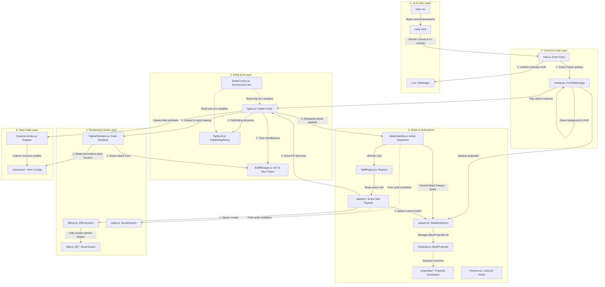

# System Architecture & Layer Dependencies

This document details the system layers, module relations, and decoupling strategies of the 2D Auto-Battle Arena project.

---

## 1. Architectural Layers Overview

The codebase is organized into 6 strict layers to maintain clean decoupling, enabling fast UI refactoring and headless battle simulations:

---

## 2. Decoupling & Isolation Principles

### 2.1 Logic-to-Render Separation
- **`fighter.js`** is a pure mathematical simulator. It stores coordinates (`x`, `y`), attributes (`hp`, `shield`, `speed`), status timers, and the state name. It does **not** perform any canvas rendering.
- **`FighterRenderer.js`** is a static helper class. It takes a canvas context (`ctx`) and a `Fighter` instance, reads the fighter's coordinates and rotation angle, and paints it on the canvas. 

### 2.2 Entity-to-Manager Isolation via `BattleContext`
Fighter entities need to know about the environment (e.g., arena boundaries, where the nearest enemies are, how to apply AoE damage) but shouldn't reference `CombatManager` directly (which would create a circular dependency).
- The **`BattleContext`** class acts as an environmental facade. It encapsulates:
  - Arena bounds (`arenaX`, `arenaY`, `arenaWidth`, `arenaHeight`)
  - Opposing team array (`opposingTeam`)
  - Friendly team array (`friendlyTeam`)
  - Callback functions for adding projectiles, spawning screen shake, or creating poison AoE pools.
- When `CombatManager` calls `Fighter.update(dt, context)`, it feeds this transient context. The fighter reads what it needs and drops the reference at the end of the frame.

### 2.3 Audio Independence
- The `SoundSystem` (`audio.js`) runs a client-side `AudioContext`. If audio is blocked by user browser permissions, it silently falls back, enabling the game's update loop to function seamlessly.
