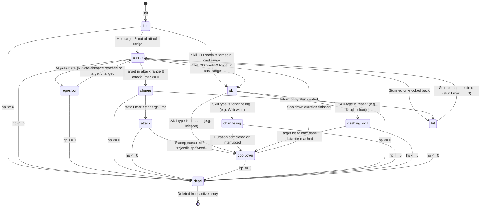

# Execution Lifecycle & Workflows

This document specifies the execution flows, detailed state transitions, and step-by-step logic pathways for frame ticking and combat events.

---

## 1. Frame Update Pipeline

In `main.js`, `requestAnimationFrame` initiates the single-thread frame update. The step-by-step workflow of a single frame update is detailed below:

```text
[main.js: gameLoop]
   │
   ├── 1. Compute delta time (dt) in seconds
   ├── 2. Check battle status (waiting, countdown, fighting, finished)
   │
   └── 3. If "fighting", delegate update to [combat.js: CombatManager]
            │
            ├── 3.1. Update Hazard Fields (toxic pools, fire rings)
            │        ├─ Check remaining duration
            │        └─ Apply DoT tick damage to standing fighters
            │
            ├── 3.2. Update Fighter Entities (Fighter.update)
            │        ├─ Tick buff/debuff timers (DOT, Stun, Freeze)
            │        ├─ Call AI module (FighterAI.findClosestTarget)
            │        └─ Run behavior state machine branches
            │
            ├── 3.3. Update Projectiles (WeaponSystem.update)
            │        ├─ Advance coordinates (x, y) by vector velocity
            │        ├─ Check arena bounds (dispose if out of bounds)
            │        └─ Resolve distance overlaps with enemy fighters
            │
            ├── 3.4. Resolve Fighter Overlaps (resolveCollisions)
            │        ├─ Loop through friendly/hostile fighter pairs
            │        ├─ Check for overlapping circles (distance < sizeA + sizeB)
            │        └─ Apply push-back displacement (elastic repulsion vector)
            │
            ├── 3.5. Update Visual Particles (EffectSystem.update)
            │        ├─ Fade damage floater text positions upwards
            │        ├─ Apply gravity and air resistance to particle velocity
            │        └─ Decrypt screen shake camera offset offsets
            │
            └── 3.6. Perform Canvas Drawing (draw)
                     ├─ Paint floor, health bars, and boundaries
                     ├─ Render fighters (via FighterRenderer)
                     └─ Render projectiles and active particle effects
```

---

## 2. Fighter Behavior State Machine

Each entity has a state machine with 11 distinct states:



---

## 3. Damage & Control Settlement Sequence

When a damage event is generated (e.g., a projectile hits, a melee swing triggers, or a DoT ticks):

```text
[Damage Event Initiated]
   │
   └── 1. Invoke [Fighter.takeDamage(amount, attacker, reason)]
            │
            ├── 1.1. Check if target is already dead. If yes, exit.
            │
            ├── 1.2. Absorb via active Shield:
            │        ├─ remainingShield = shield - amount
            │        ├─ shield = max(0, remainingShield)
            │        └─ damageToHP = max(0, -remainingShield)
            │
            ├── 1.3. Deduct health: hp = max(0, hp - damageToHP)
            │
            ├── 1.4. Apply Lifesteal back to Attacker:
            │        └─ if attacker.lifesteal > 0, attacker.heal(damageToHP * lifesteal)
            │
            ├── 1.5. Dispatch AV feedback to managers:
            │        ├─ [EffectSystem] Spawn red text floater (or blue for shields)
            │        ├─ [EffectSystem] Spawn impact sparks (colored by character)
            │        └─ [SoundSystem] Synthesize playHit() osc tone
            │
            ├── 1.6. Check status debuff modifications:
            │        └─ If hit carries "stun" attribute, set stunTimer & change state to 'hit'
            │
            └── 1.7. Check health threshold:
                     └─ if hp <= 0, set alive = false, state = 'dead', trigger playDeath()
```
