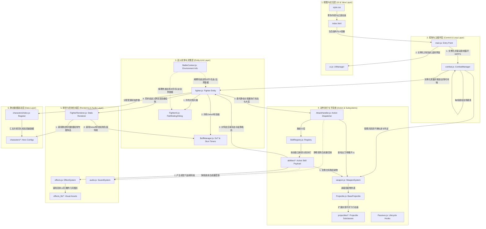
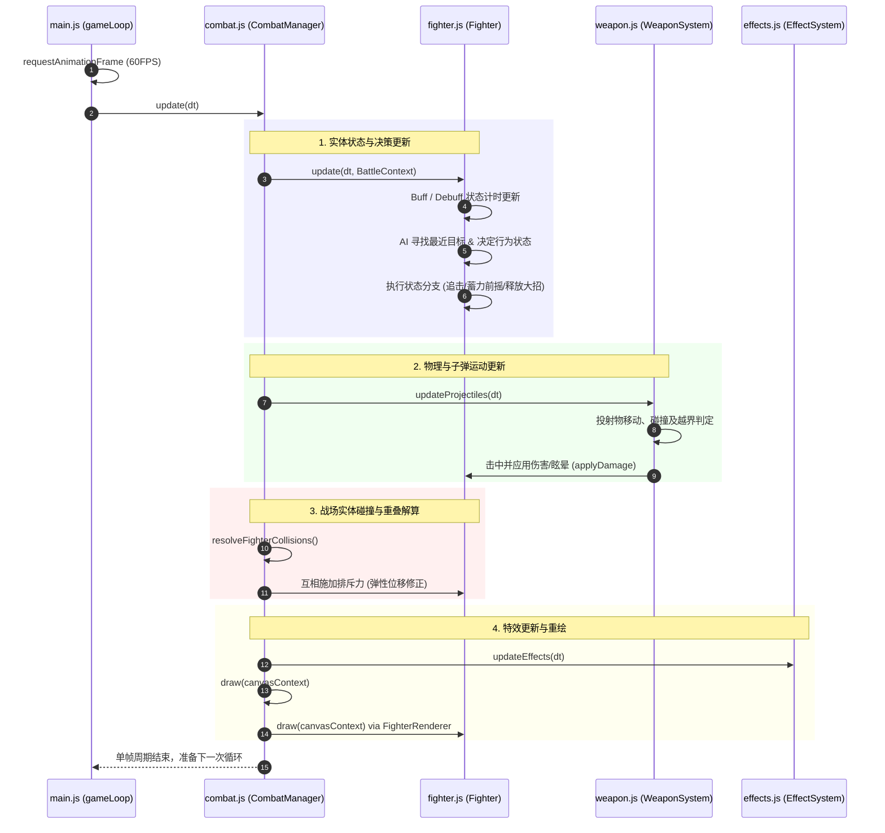
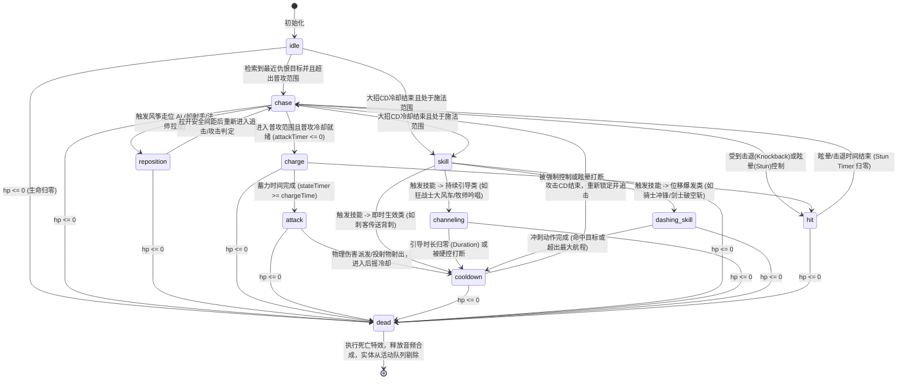

# 2D 自动战斗竞技场代码架构详解文档 (Code Specification)

本文档面向系统开发者，旨在深入剖析 2D 自动战斗竞技场项目的所有核心源代码模块、设计模式、数据流向、关键算法数学实现，并提供一份手把手的二次开发实战指南。

---

## 系统架构图与模块依赖关系 (System Architecture)

整个竞技场的代码采用分层的模块化设计。各层之间职责明确，数据单向流转，通过战斗上下文（BattleContext）和回调观察者模式（Observer Callbacks）实现了高度解耦。以下是系统的整体架构图与模块依赖关系：



### 架构设计关键要点

1. **核心驱动流**：`main.js` 作为控制中枢，以 `requestAnimationFrame` 驱动 `gameLoop`，在每一帧计算出 `dt` 并向下传导给 `CombatManager` 的 `update`，后者再进一步更新所有的子系统与实体状态。其单帧更新周期的具体生命周期与模块交互时序如下图所示：



2. **完全解耦设计**：
   - **数据与逻辑解耦**：所有的英雄参数（HP、移速等）和武器样式绘制，完全存放在 `characters/*.js` 静态配置中。Fighter 仅通过字符 ID 初始化，没有硬编码的战士逻辑。
   - **渲染与逻辑解耦**：`fighter.js` 中没有包含任何 Canvas 绘制代码，只保留位置、生命值和当前状态。图形绘制完全交给 `FighterRenderer.js` 静态读取，以便后续移植到 WebGL 渲染器或非 Canvas 的服务器后台模拟。
   - **双向依赖解耦**：Fighter 实例不直接访问 `CombatManager`，而是通过轻量级的 `BattleContext` 环境信息读取器获知对方队伍和竞技场大小，极大地提升了实体的安全性与测试性。
3. **音效零依赖**：`audio.js` 封装的音频引擎，无需在网络中下载任何声音资源，完全依靠 CPU 计算波形输入声卡，不仅节省了网络带宽，还彻底规避了文件读取权限的限制。

---

## 第一部分：项目文件树与模块职责树


整个项目为纯静态的前端 Web 应用，文件结构设计清晰，遵从“单一职责原则”，分离了数据层、逻辑层、渲染层和特效层。

### 1.1 核心控主机逻辑模块职责

- `index.html`：项目的主入口，承载着 Canvas 画布的容器（#battle-canvas）和毛玻璃拟态的控制面板。它引入了 Google Fonts 字体（Outfit 与 Noto Sans SC）并声明了核心模块导入 `<script type="module" src="js/main.js"></script>`。
- `css/style.css`：定义了整套游戏的视觉样式系统。包含了 CSS 自定义变量（色板、阴影、圆角），毛玻璃类样式 `.screen`、`.team-panel`，生命条与倒计时大字的自适应排版，以及英雄卡片悬停放大的 3D 转换动画。
- `js/main.js`：游戏统一的启动挂载器。它监听 `DOMContentLoaded` 事件，实例化 `CombatManager` 和 `UIManager`，并在游戏主帧循环 `gameLoop` 中以 60FPS 频率调用战场物理逻辑更新与视觉重绘。
- `js/combat.js`：定义了 `CombatManager` 类。它是游戏世界物理法则和战役生命周期的维护者，掌控着所有战士的数组、投射物队列、地表残留毒液法术场，并集中进行圆周碰撞相交检测与弹性排斥解算。
- `js/fighter.js`：定义了 `Fighter` 类。代表战场上的每一个战士。它内置了一个包含 `idle`、`chase`、`charge`、`attack`、`cooldown`、`skill`、`channeling`、`reposition`、`dashing_skill`、`hit` 和 `dead` 共 11 种状态的行为状态机。
- `js/BattleContext.js`：定义了 `BattleContext` 类。它是一个只读的环境信息传递体，封装了本队数组、敌队数组、战场尺寸及添加毒区和范围伤害的函数指针，实现了 Fighter 与 CombatManager 的解耦。
- `js/ui.js`：定义了 `UIManager` 类。主要利用 `document.getElementById` 直接操纵 DOM 节点进行选人界面、HUD 属性百分比血条、Rematch 遮罩层以及英雄图鉴（Codex）的数据生成与状态切换。
- `js/audio.js`：定义了 `SoundSystem` 类。核心是不使用任何外部音频文件，完全利用 Web Audio API 创建 `AudioContext`，通过正弦波、方波、三角波和低通滤波的白噪声实时合成攻击、射击、大招就绪、复活和死亡的音效。
- `js/effects.js`：定义了 `EffectSystem` 类。主宰战场上的粒子池。负责在实体受击时生成溅射火花粒子，计算屏幕震动的衰减偏置量，以及维护伤害漂浮字体的重力坠落。
- `js/utils.js`：定义了通用的数学几何工具函数。包含用于防御 NaN 崩溃的 `safeFinite`、计算安全位移向量的 `safeDirection`、角度正交规整的 `normaliseAngle` 以及把数值锁定在上下限的 `clamp`。
- `js/weapon.js`：定义了 `WeaponSystem` 类。用于注册和飞行战场上所有的投射物（Projectile），并且对近战挥砍的扇形碰撞进行相交判定。

---

### 1.2 22个角色的静态数值与 drawDecorations 绘图代码结构

为了让开发者彻底搞懂数据驱动的属性含义，我们展示数个核心英雄在代码中的静态配置全貌：

#### 1.2.1 狂战士配置 (Berserker.js)
```javascript
export const berserker = {
  id: 'berserker',
  name: 'Berserker',
  nameCN: '狂战士',
  color: '#D32F2F',            // 主色：鲜红
  secondaryColor: '#FF6F00',   // 副色：橙色
  glowColor: 'rgba(211, 47, 47, 0.55)',

  // 基础三围属性
  size: 34,                    // 体积半径
  speed: 5.2,                  // 移动速度（px/帧）
  hp: 100,                     // 最大生命
  attackPower: 26,             // 基础普攻攻击力
  attackSpeed: 2.0,            // 普攻CD（秒）
  chargeTime: 0.4,             // 普攻前摇时间
  attackRange: 78,             // 普攻射程范围（近战）
  lifesteal: 0.12,             // 12% 吸血

  // 寻路走位模式与AI设定
  movePattern: 'linear',       // 直线直奔目标
  aiTendency: 'aggressive',    // 好战倾向，残血不退避
  weaponType: 'melee',
  projectileType: null,

  // 被动声明
  passives: [
    {
      id: 'blood_rage',
      name: '血怒',
      description: '生命值越低，攻击速度和移动速度越快。'
    }
  ],

  // 专属引导大招：大风车旋转
  skill: {
    name: '大风车',
    cooldown: 10.0,            // 大招 CD 秒数
    damage: 10,                // 每次大招 tick 的伤害
    range: 95,                 // 伤害圈半径
    type: 'whirlwind',         // 注册表映射键值
    duration: 2.0,             // 持续引导 2.0 秒
    channelTickInterval: 0.25  // 每 0.25 秒结算一次伤害与吸血
  },

  // 2D Canvas 图形修饰绘制
  drawDecorations: function(ctx, x, y, angle, size, time) {
    ctx.save();
    ctx.translate(x, y);
    ctx.rotate(angle);

    // 绘制狂战士特有的长柄双头巨斧
    ctx.strokeStyle = '#5D4037'; // 棕色斧柄
    ctx.lineWidth = 3;
    ctx.beginPath();
    ctx.moveTo(10, -5);
    ctx.lineTo(25, -5);
    ctx.stroke();

    // 绘制双侧对称斧刃
    ctx.fillStyle = '#D32F2F';   // 红色斧刃
    ctx.beginPath();
    ctx.arc(23, -5, 12, -Math.PI / 2, Math.PI / 2);
    ctx.lineTo(23, -5);
    ctx.closePath();
    ctx.fill();

    ctx.restore();
  }
};
```

#### 1.2.2 刺客配置 (Assassin.js)
```javascript
export const assassin = {
  id: 'assassin',
  name: 'Assassin',
  nameCN: '刺客',
  color: '#263238',            // 暗影漆黑色
  secondaryColor: '#FF1744',   // 锋芒亮红
  glowColor: 'rgba(38, 50, 56, 0.6)',

  size: 28,
  speed: 6.2,                  // 极速跑位
  hp: 68,                      // 脆皮
  attackPower: 32,             // 高额攻击
  attackSpeed: 1.4,
  chargeTime: 0.2,
  attackRange: 65,
  lifesteal: 0,

  movePattern: 'arc',          // 圆弧轨道公转绕侧寻路
  aiTendency: 'aggressive',
  weaponType: 'melee',
  projectileType: null,

  skill: {
    name: '影杀背刺',
    cooldown: 7.0,
    damage: 45,                // 极高的刺杀直击暴击伤害
    range: 150,
    type: 'backstab',          // 瞬移背刺类型
    duration: 0.5
  },

  drawDecorations: function(ctx, x, y, angle, size, time) {
    ctx.save();
    ctx.translate(x, y);
    ctx.rotate(angle);

    // 在其身后绘制两把交叉的深红匕首刀鞘
    ctx.strokeStyle = '#FF1744';
    ctx.lineWidth = 2.5;
    ctx.beginPath();
    ctx.moveTo(-8, -8);
    ctx.lineTo(-20, -18);
    ctx.moveTo(-8, 8);
    ctx.lineTo(-20, 18);
    ctx.stroke();

    ctx.restore();
  }
};
```

#### 1.2.3 一拳超人配置 (OnePunchMan.js)
```javascript
export const one_punch_man = {
  id: 'one_punch_man',
  name: 'OnePunchMan',
  nameCN: '一拳超人',
  color: '#FFEA00',            // 明黄外套
  secondaryColor: '#FF1744',   // 亮红拳套
  glowColor: 'rgba(255, 234, 0, 0.55)',

  size: 33,
  speed: 5.5,
  hp: 120,
  attackPower: 30,
  attackSpeed: 1.6,
  chargeTime: 0.3,
  attackRange: 70,
  lifesteal: 0,

  movePattern: 'linear',
  aiTendency: 'aggressive',
  weaponType: 'melee',
  projectileType: null,

  passives: [
    {
      id: 'saitama_dodge',
      name: '完美闪避',
      description: '有 35% 几率避开一切物理和魔法伤害。'
    }
  ],

  skill: {
    name: '认真一拳',
    cooldown: 15.0,            // 超长大招CD
    damage: 99,                // 秒杀级真实伤害
    range: 130,
    type: 'serious_punch',
    duration: 0.6
  },

  drawDecorations: function(ctx, x, y, angle, size, time) {
    ctx.save();
    ctx.translate(x, y);
    ctx.rotate(angle);

    // 绘制背后的白色超人披风
    ctx.fillStyle = '#FFFFFF';
    ctx.beginPath();
    ctx.moveTo(-size, -12);
    ctx.quadraticCurveTo(-size - 18 - Math.sin(time * 6) * 4, -18, -size - 22, -10);
    ctx.lineTo(-size - 22, 10);
    ctx.quadraticCurveTo(-size - 18 - Math.sin(time * 6) * 4, 18, -size, 12);
    ctx.closePath();
    ctx.fill();

    // 绘制身前的红色铁拳
    ctx.fillStyle = '#FF1744';
    ctx.beginPath();
    ctx.arc(size - 3, -6, 5, 0, Math.PI * 2);
    ctx.arc(size - 3, 6, 5, 0, Math.PI * 2);
    ctx.fill();

    ctx.restore();
  }
};
```

---

### 1.3 核心大招执行代码实现 (js/skills/abilities/)

我们深入探究大招执行器，理解它们在触发瞬间如何与战场环境实体发生数学和物理上的交互：

#### 1.3.1 大风车引导技能实现 (Whirlwind.js)
持续施法不仅包含起手爆发，还包含了每帧 Tick 特效更新和固定间隔的 Damage 扣血结算：

```javascript
// js/skills/abilities/Whirlwind.js
import * as EffectLib from '../../effects_lib/index.js';

/**
 * 1. 起手爆发：大风车起手瞬间调用，爆发气浪特效
 */
export function executeWhirlwind(caster, skill, weaponSystem, effectSystem) {
  EffectLib.addAoeMeleeEffect(effectSystem, caster.x, caster.y, caster.charData.color, skill.range);
  effectSystem.screenShake(5); // 起手轻微震屏
}

/**
 * 2. 每帧执行：驱动自转与气流拖尾渲染
 */
export function executeWhirlwindTick(caster, skill, effectSystem, dt) {
  // 英雄以 18 弧度每秒的极高角速度疯狂自转
  caster.angle += dt * 18;
  
  // 每一帧在脚底排泄橙色大风车刀光拖尾粒子
  if (Math.random() < 0.55) {
    effectSystem.addTrail(
      caster.x + (Math.random() - 0.5) * 20,
      caster.y + (Math.random() - 0.5) * 20,
      caster.charData.secondaryColor + '40', // 半透明橙色
      6.0
    );
  }
}

/**
 * 3. 间隔周期执行：结算伤害范围与吸血
 */
export function executeWhirlwindDamage(caster, skill, effectSystem) {
  const opposingTeam = caster.battleContext.opposingTeam;
  if (!opposingTeam) return;

  opposingTeam.forEach(enemy => {
    if (!enemy.isAlive()) return;
    
    // 计算两实体的相对距离
    const dx = enemy.x - caster.x;
    const dy = enemy.y - caster.y;
    const dist = Math.sqrt(dx * dx + dy * dy);

    // 95px 大风车半径包络检测
    if (dist <= skill.range) {
      enemy.takeDamage(skill.damage, caster.x, caster.y, effectSystem);
      caster.healFromDamage(skill.damage, effectSystem); // 大风车吸血回复
      effectSystem.addHitEffect(enemy.x, enemy.y, caster.charData.color);
    }
  });
}
```

#### 1.3.2 刺客传送背刺实现 (Backstab.js)
```javascript
// js/skills/abilities/Backstab.js
import * as EffectLib from '../../effects_lib/index.js';
import { soundSystem } from '../../audio.js';

export function executeBackstab(caster, skill, weaponSystem, effectSystem) {
  const target = caster.target;
  if (!target || !target.isAlive()) {
    caster.setState('chase');
    return;
  }

  // 1. 施放暗影法阵
  EffectLib.addCloneEffect(effectSystem, caster.x, caster.y, caster.charData.color, 35);
  if (soundSystem) soundSystem.playShootSound();

  // 2. 计算目标英雄的背后坐标
  // 刺客传送到目标背后 40px 的位置
  const targetAngle = target.angle;
  const behindX = target.x - Math.cos(targetAngle) * 40;
  const behindY = target.y - Math.sin(targetAngle) * 40;

  // 3. 瞬移刺客
  caster.x = behindX;
  caster.y = behindY;

  // 4. 将刺客调整为朝向敌人后心
  caster.angle = targetAngle;

  // 5. 修改状态机，进入 dashing_skill 状态进行终极斩杀结算
  caster.setState('dashing_skill');
  caster.dashSkillType = 'backstab';
  caster.dashStartX = caster.x;
  caster.dashStartY = caster.y;
  caster.dashTargetX = target.x;
  caster.dashTargetY = target.y;
  caster.dashDuration = 0.08; // 极速瞬刺（80毫秒内滑过去）
  caster.dashTimer = 0;
}
```

---

## 第二部分：核心模块源码深度剖析

下面我们将深入分析几个对战场逻辑起到决定性作用的核心模块。

### 2.1 `js/fighter.js` —— 核心实体状态机解析
战士的物理运转和逻辑跃迁由其 `update(dt, ctx)` 方法驱动。它内置了 11 种行为状态，具体状态跃迁转换逻辑如下图所示：



每个 Fighter 实例的单帧物理运转和逻辑更新均在 `update(dt, ctx)` 方法中完成，代码主体骨架解构如下：

```javascript
update(dt, ctx) {
  this.battleContext = ctx;
  const { weaponSystem, effectSystem, arenaWidth, arenaHeight, arenaX, arenaY, opposingTeam } = ctx;

  // 1. 防御性位置判定，防止物理越界产生的 NaN 污染
  this.x = safeFinite(this.x, arenaX + arenaWidth / 2);
  this.y = safeFinite(this.y, arenaY + arenaHeight / 2);
  this.hp = safeFinite(this.hp, this.maxHp);
  this.angle = normaliseAngle(this.angle);

  if (!this.alive && this.state !== 'dead') return;

  // 2. 调用决策树，获取最近仇恨目标
  this.ai.findClosestTarget(opposingTeam);

  // 3. 全局状态计时器更新
  this.stateTimer += dt;
  const attackTimerRate = this.getAttackTimerRate(); // 计算被动对攻速的影响
  this.attackTimer = Math.max(0, this.attackTimer - dt * attackTimerRate);
  this.skillCooldown = Math.max(0, this.skillCooldown - dt);
  this.buffs.update(dt, effectSystem); // debuff计时器更新

  // 4. 大招起手判定
  if (this.canCastSkillNow()) {
    this.setState('skill');
  }

  // 5. 运行状态机逻辑分支
  switch (this.state) {
    case 'chase':
      if (!this.target || !this.target.isAlive()) break;
      // 判定距离：若小于普攻距离且冷却为零，进入 charge (前摇蓄力)
      const dx = this.target.x - this.x;
      const dy = this.target.y - this.y;
      const dist = Math.sqrt(dx * dx + dy * dy);

      if (dist <= this.charData.attackRange && this.attackTimer <= 0) {
        this.setState('charge');
      } else {
        // AI 控制位移
        this.ai.applyMovement(dt, ctx);
      }
      break;

    case 'charge':
      // 蓄力期间向四周吸收粒子
      if (Math.random() < 0.3) {
        effectSystem.addChargeEffect(this.x, this.y, this.charData.color);
      }
      // 近战在蓄力期继续往前追赶以防出刀打空
      if (this.charData.weaponType === 'melee') {
        this.ai.applyMovement(dt * 0.8, ctx);
      }
      if (this.stateTimer >= this.charData.chargeTime) {
        this.setState('attack'); // 进入出刀判定
      }
      break;

    case 'attack':
      if (!this.attackExecuted) {
        this.attackExecuted = true;
        // 静态分发攻击行为，生成伤害判定
        AttackHandler.executeAttack(this, weaponSystem, effectSystem);
        this.attackTimer = this.charData.attackSpeed;
      }
      if (this.stateTimer >= 0.15) {
        this.setState('cooldown');
      }
      break;
    
    // ... 其他状态如 dead, hit, channel ...
  }
}
```

---

### 2.2 `js/audio.js` —— 基于波形合成的原生音频引擎
游戏没有包含任何一张 `.mp3`，而是基于浏览器内置的 `AudioContext` 进行波形调制。我们深入解构其战音效 tone 算法：

```javascript
_playTone(type, startFreq, endFreq, duration, volMulti = 1) {
  if (!this.enabled || !this.ctx) return;
  
  const t = this.ctx.currentTime;
  const osc = this.ctx.createOscillator(); // 1. 创建波形震荡器
  const gain = this.ctx.createGain();       // 2. 创建音量增益控制器

  osc.type = type; // 支持 'sine', 'square', 'triangle', 'sawtooth'
  osc.frequency.setValueAtTime(startFreq, t); // 设置起始频率
  
  // 3. 如果需要音调滑动（如激光 Pew-Pew 声），进行频率包络控制
  if (endFreq) {
    osc.frequency.exponentialRampToValueAtTime(endFreq, t + duration);
  }

  // 4. 音量包络控制：快速衰减以避免声音爆音
  gain.gain.setValueAtTime(this.volume * volMulti, t);
  gain.gain.exponentialRampToValueAtTime(0.001, t + duration); // 指数衰减至静音

  osc.connect(gain);
  gain.connect(this.ctx.destination); // 5. 连接到扬声器

  osc.start(t);
  osc.stop(t + duration); // 定时释放震荡器节点
}
```
**声音合成参数设定**：
- **Hit Sound (受击声)**：抛掷时间 0.1s 的白噪声，截止频率 1000Hz 低通滤波，提供短促沉闷的撞击物理感。
- **Shoot Sound (发射声)**：`square`（方波），起始 600Hz 在 0.1s 内指数拉低到 200Hz，实现复古红白机 PewPew 的快感。
- **Swing Sound (挥剑声)**：`sine`（正弦波），起始 200Hz 在 0.15s 内滑落至 50Hz，模拟空气重摩擦声。
- **Summon Sound (召唤声)**：`triangle`（三角波），起始 150Hz 在 0.5s 内缓慢落回 50Hz，形成深沉的地面魔法大阵轰鸣。
- **Death Sound (死亡声)**：`sawtooth`（锯齿波），起始 300Hz 在 0.5s 内拉低到 50Hz，声音尖锐而迅速衰退。

---

## 第三部分：关键算法数学原理与代码精讲

下面讲解这套物理沙盒中两个具有高难度几何计算的经典算法。

### 3.1 线性碰撞贯穿算法 (Spearman Pierce Line Calculation)
长枪兵的矛刺和孙悟空的金箍棒能够贯穿直线排开的敌人。
- **数学原理**：判断一个敌人 $E(x_e, y_e)$ 是否处在施法者 $C(x_c, y_c)$ 沿当前朝向角 $\theta$ 刺出、宽为 $W$、长为 $L$ 的长条状矩形范围内。

```
          (dirX, dirY) ─► 朝向角 θ
    C o─────────────────────────────┐  ▲ 宽 W/2
      │                             │  │
      │           E (xe, ye)        │  ▼ 中轴线
      │                             │  ▲ 宽 W/2
      └─────────────────────────────┘  ▼
      ◄─────────────── 长度 L ──────►
```

1. 计算施法者的前向归一化方向向量：
   $$dirX = \cos(\theta), \quad dirY = \sin(\theta)$$
2. 将敌人到施法者的相对位移向量投影到该方向向量及法向量上。相对向量为 $(ex, ey) = (x_e - x_c, y_e - y_c)$。
3. **前向正投影长度**（Forward Projection）：
   $$forward = ex \cdot dirX + ey \cdot dirY$$
4. **横向偏离轴线距离**（Side Distance）：
   $$side = |ex \cdot dirY - ey \cdot dirX|$$
5. 判断敌人是否在枪刺矩形内的判定条件为：
   $$0 \le forward \le L \quad \text{且} \quad side \le \frac{W}{2}$$

这在 `js/skills/Passives.js` 中的对应代码如下：
```javascript
export function applyPiercingLineDamage(fighter, damage, range, width, primaryTarget, effectSystem) {
  const opposingTeam = fighter.battleContext.opposingTeam;
  if (!opposingTeam) return;

  const dirX = Math.cos(fighter.angle);
  const dirY = Math.sin(fighter.angle);

  opposingTeam.forEach(enemy => {
    if (!enemy.isAlive() || enemy === primaryTarget) return; // 排除死尸和主目标
    const ex = enemy.x - fighter.x;
    const ey = enemy.y - fighter.y;

    // 数学投影运算
    const forward = ex * dirX + ey * dirY; 
    const side = Math.abs(ex * dirY - ey * dirX);

    // 进行矩形碰撞边界扫描
    if (forward >= 0 && forward <= range && side <= width / 2) {
      enemy.takeDamage(damage, fighter.x, fighter.y, effectSystem);
      effectSystem.addHitEffect(enemy.x, enemy.y, fighter.charData.color);
    }
  });
}
```

---

### 3.2 风筝驻点最优选路算法 (Kiting Waypoint Calculation)
远程英雄（如射手）需要智能寻找远离敌人威胁的最佳角落。
- **算法设计**：在地图的边界及中间位置设置 8 个固定的战术驻点（Waypoints）。
- 在每次进行重定位（state = 'reposition'）时，远程英雄遍历这 8 个点，计算每一个驻点与当前仇恨目标之间的欧几里得距离平方：
  $$DistSq = (wp.x - target.x)^2 + (wp.y - target.y)^2$$
- 筛选出 $DistSq$ 最大（即全图距离敌人位置最远）的那一个驻点，作为本次规避奔跑的目的地。

这一逻辑在 `js/ai/FighterAI.js` 中的实现如下：
```javascript
startReposition(ctx) {
  this.fighter.setState('reposition');
  this.fighter.repositionDuration = 2.0 + Math.random() * 1.5; // 战术移动机动时间

  const { arenaX, arenaY, arenaWidth, arenaHeight } = ctx;

  if (this.fighter.charData.weaponType === 'ranged') {
    this.fighter.repositionType = 'waypoint';

    if (this.fighter.target && this.fighter.target.isAlive()) {
      const enemyX = this.fighter.target.x;
      const enemyY = this.fighter.target.y;

      // 1. 声明 8 个边界与中线交织的战术角落
      const candidates = [
        { x: arenaX + 40, y: arenaY + 40 },                  // 左上
        { x: arenaX + arenaWidth - 40, y: arenaY + 40 },      // 右上
        { x: arenaX + arenaWidth - 40, y: arenaY + arenaHeight - 40 }, // 右下
        { x: arenaX + 40, y: arenaY + arenaHeight - 40 },      // 左下
        { x: arenaX + arenaWidth / 2, y: arenaY + 40 },       // 上中
        { x: arenaX + arenaWidth / 2, y: arenaY + arenaHeight - 40 }, // 下中
        { x: arenaX + 40, y: arenaY + arenaHeight / 2 },       // 左中
        { x: arenaX + arenaWidth - 40, y: arenaY + arenaHeight / 2 }  // 右中
      ];

      let maxDist = -1;
      let bestPoint = candidates[0];

      // 2. 遍历评估最近仇恨目标
      for (const pt of candidates) {
        const dx = pt.x - enemyX;
        const dy = pt.y - enemyY;
        const distSq = dx * dx + dy * dy; // 距离平方规避开平方的 CPU 算力消耗
        if (distSq > maxDist) {
          maxDist = distSq;
          bestPoint = pt; // 记录最安全最远的点
        }
      }

      this.fighter.repositionWaypointX = bestPoint.x;
      this.fighter.repositionWaypointY = bestPoint.y;
    }
  }
}
```
