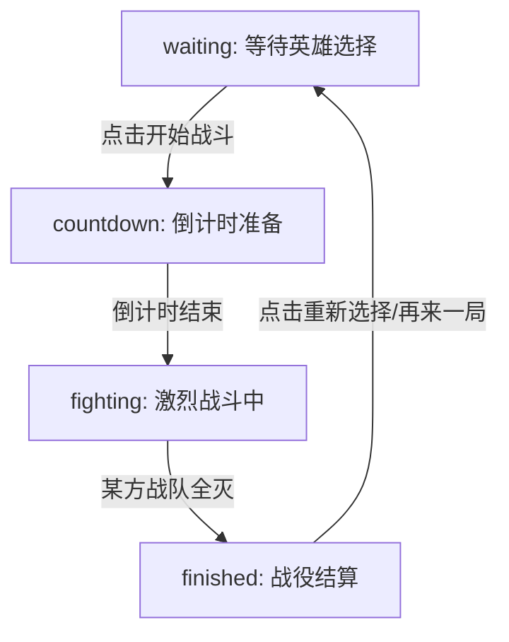

# 2D 自动战斗竞技场项目详解文档 (Project Specification)

本文档将从项目定位、核心玩法、角色系统配置、物理运动数学引擎、特效与图形渲染池、Web Audio 音频合成器以及部署跨设备迁移等多个维度，对本项目进行源码级别的系统化架构解析。

---

## 第一部分：项目整体概览与设计哲学

### 1.1 项目核心定位与愿景
本项目是一个基于 HTML5 Canvas 和纯原生 JavaScript 构建的 **2D 多角色自动战斗竞技场（2D Auto-Battle Arena）**。在这个沙盒世界中，玩家可以通过精美的玻璃拟态（Glassmorphism）UI 界面，自由挑选并搭配左、右两支由不同能力英雄组成的战队，设置战斗倍速，然后在动态 Arena（沙盒竞技场）中观摩高强度的战术对决。

本游戏采用全自动运行模式。两支战队的英雄在生成后，将自动寻找最近的敌人、规划战术移动路线、进行普通攻击，并在冷却就绪且射程足够时自动释放专属大招。整场战斗通过物理引擎处理实体间的推挤碰撞，通过粒子系统表现绚丽的打击与爆破效果，并通过网页浏览器自带的音频合成功能实时演奏声效，带给玩家极致的视觉与听觉享受。

### 1.2 纯静态、无引擎的开发优势
在当前的网页前端开发领域，很多哪怕是十分轻量的 2D 游戏，也习惯于引入诸如 Pixi.js, Phaser, Cocos2d-js 等体积庞大的第三方游戏框架，或者依赖 Webpack, Vite 等复杂的打包转译工具。这虽然带来了一些便捷性，但也让整个工程堆叠了繁多的中间依赖，导致代码量剧增、运行前需要繁琐安装环境，在跨设备迁移或单机离线演示时极易因兼容性问题白屏。

本项目的核心设计哲学是：**“零构建、零依赖、纯原生、随处运行”**。
- **零构建工具**：直接采用原生 ES Modules (ESM) 规范，通过浏览器底层的 `import` 与 `export` 语法进行文件组织与加载。
- **纯原生 Canvas 2D 渲染**：利用浏览器自带的高性能二维上下文（CanvasRenderingContext2D）进行全画幅粒子渲染与图形绘制，完美绕过外部渲染引擎的复杂配置，并极大降低了对系统硬件资源的要求。
- **零音频文件依赖**：抛弃了传统的 `.mp3` 或 `.wav` 音频文件，完全利用 Web Audio API 合成声音。
- **卓越的跨设备分发性**：整套项目仅由数个静态 JS 模块、一个 HTML 页面和一个样式文件构成，可放在任何简单的服务器上甚至双击本地运行。

### 1.3 核心技术栈
1. **结构层**：HTML5 语义化标签与 Canvas 画布容器，提供精炼的 DOM 骨架。
2. **样式层**：CSS3 变量、毛玻璃（backdrop-filter）、自适应 Flex/Grid 布局、响应式设计以及丝滑的悬停与点击过渡动画。
3. **逻辑层**：ECMAScript 6 (ES6) 模块化机制、Canvas 2D 渲染引擎、基于向量的物理碰撞解算器、Web Audio API 合成器。
4. **测试与工具**：项目内含基于 Node.js, Puppeteer, Jsdom 和 Babel 的自动化测试脚本，用于评估战场平衡性。

---

## 第二部分：核心玩法与游戏规则机制

### 2.1 战役生命周期状态机
战斗管理器（CombatManager）是整个游戏流程的核心驱动者。它内部维护了一个严密的战役生命周期状态机，包含以下四个状态：



- **waiting（等待阶段）**：主界面为玩家展示两队的英雄列表，此阶段 Canvas 处于休眠状态，不消耗显卡资源。玩家在此阶段可以自由勾选左队与右队登场的战士，支持“全部全选”和“全部清空”的快捷操作。
- **countdown（倒计时准备）**：当玩家点击开始战斗按钮时，游戏状态转入倒计时。系统在画面正中渲染由 3 到 1 的放大脉冲特效，伴随 Web Audio 升调电子音。此时英雄被实例化并摆放在两端出生点，他们虽然已呈现，但处于眩晕（Stun）状态，确保无法提前移动，实现公平竞技。
- **fighting（战斗阶段）**：全帧率运行物理引擎、AI 决策树、技能冷却缩减和伤害结算逻辑。此阶段是游戏运行最激烈的时刻，每一帧都在进行实时的位置运算、碰撞解算、被动判定和特效生成。
- **finished（战役结算阶段）**：当某队全部英雄的死亡状态（alive = false）生效时，状态机跃迁至此。此时会维持 1.5 秒的缓冲期（`finishedTimer = 1.5`），允许战场上未完结的投射物、爆炸、流血 DoT 和中毒烟雾等特效播放完毕，随后弹出胜利/平局信息与战斗时间分析。

### 2.2 团队对抗机制
战场被对称划分为**左队（Left Team）**与**右队（Right Team）**。
- **视觉识别**：左队成员在脚下拥有亮蓝色（`#00E5FF`）的基底环与发光效果，而右队成员脚下则是亮橘红色（`#FF3D00`）的环。所有的伤害数字、治疗数字和光环也都据此区分颜色，防止战斗混乱时玩家失去焦点。
- **空间生成**：左队默认在竞技场左侧（纵向居中、横向偏移 80px）以等间距（纵向间距 70px）列队生成；右队在竞技场右侧（横向偏移 arenaWidth - 80px）对称生成。
- **胜负判定**：在 `update` 循环的末尾，执行生命安全检查。只要某一方阵营的所有成员都转化为死尸（`hp = 0, alive = false`），就会宣布对立面获胜。若双方在同一帧均无存活单位，则宣判平局（Draw）。

### 2.3 动态英雄图鉴与 HUD
- **Hero Codex（英雄图鉴）**：允许用户在非战斗状态下随时展开一个遮罩层，查看全部英雄的精美卡片。卡片包含了该英雄的中文译名、基础生命、攻击力、武器性质（近战/远程）、移速与技能的图文介绍。
- **战斗 HUD**：位于竞技场上方，动态渲染当前双方战队总存活英雄数量的 HP 进度条，根据所选人数加权算出平均血量占比，直观反映战场实力对比。

### 2.4 战斗伤害结算与音画特效分发数据流 (AV Dispatch & Damage DFD)

在激烈战斗阶段，伤害判定不仅是数值的增减，它还是驱动整个视觉渲染池和 Web Audio 合成器进行实时响应的数据中枢。整个战斗伤害结算与音画特效分发的详细数据流向图如下所示：

```mermaid
graph TD
    %% 触发源
    subgraph Trigger_Source ["伤害触发源 (Trigger Source)"]
        F1["Fighter.js (攻击者)"]
    end

    %% 控制分发层
    subgraph Dispatch_Layer ["分发处理层 (Dispatch Layer)"]
        AH["AttackHandler.js (分发器)"]
        SR["SkillRegistry.js (技能库)"]
        WS["WeaponSystem.js (武器系统)"]
    end

    %% 结算处理核心
    subgraph Calculation_Core ["结算处理核心 (Calculation Core)"]
        F2["Fighter.js (受害者)"]
        BM["BuffManager.js (持续伤害 DoT/状态)"]
    end

    %% 视觉与听觉呈现层
    subgraph Feedback_Layer ["音画反馈层 (AV Feedback Layer)"]
        ES["EffectSystem.js (粒子/飘字/震屏)"]
        AS["SoundSystem.js (Web Audio 合成器)"]
    end

    %% 依赖与流动方向
    F1 -->|1. 发起普攻| AH
    F1 -->|1. 施放大招| SR
    
    AH -->|2a. 近战挥砍 / 召唤投射物| WS
    SR -->|2b. 技能载荷物理检测| WS
    SR -->|2b. 即时结算伤害| F2
    
    WS -->|3. 碰撞/范围检测重叠| F2
    
    F2 -->|4a. 计算扣减 HP, 削减护盾, 吸血回馈| F1
    F2 -->|4b. 挂载 Buff (流血, 眩晕, 冰冻)| BM
    
    BM -->|5. 每帧更新 DoT 伤害| F2
    
    %% 派发给音画
    F2 -->|6a. 触发受击粒子与数值漂浮字| ES
    F2 -->|6b. 触发重创屏幕震动偏置| ES
    
    AH -.->|7a. 派发攻击/击击波形音效| AS
    SR -.->|7b. 派发技能释放与回音音效| AS
    F2 -.->|7c. 派发死亡与哀鸣音效| AS
```

数据流主要呈现以下特征：
1. **强同步时效**：物理碰撞重叠事件触发后，生命值和状态数据的变更在同一帧发生，随后在该帧的末尾流向 `EffectSystem` 中生成带有重力和随机弧度散开的受击粒子，保证了物理与视觉的零延时一致。
2. **事件驱动声音**：`SoundSystem` 纯静默接收来自 `AttackHandler` 或大招载荷派发的音调指令，使用正弦波和白噪声振荡器以实时计算出的声波播放。由于没有任何 `.mp3` 读取的 IO 阻塞，游戏声音的延迟极低且极度轻量。

---

## 第三部分：角色配置与英雄属性系统

在 `js/characters/` 目录中，角色是以静态 JS 对象的形式进行定义。我们对全部 22 个角色（含召唤物）的数值特征、定位意图、技能描述和独特的视觉效果进行深度剖析：

### 3.1 狂战士 (Berserker)
- **设计哲学**：设计灵感来源于北欧神话中的狂暴战士，生命值越低战斗力越强，是不折不扣的战场收割者。
- **基础数值表**：
  - 唯一标识 (ID)：`berserker`
  - 名字 (CN)：狂战士 | 名字 (EN)：Berserker
  - 身体半径 (Size)：34px
  - 移动速度 (Speed)：5.2px/帧
  - 最大生命 (HP)：100
  - 基础攻击力 (AttackPower)：26
  - 基础攻击频率 (AttackSpeed)：2.0s
  - 攻击前摇 (ChargeTime)：0.4s
  - 攻击范围 (AttackRange)：78px
  - 基础吸血比例 (Lifesteal)：12%
  - 移动模式 (MovePattern)：`linear`
  - AI 倾向 (AITendency)：`aggressive`
  - 武器类型 (WeaponType)：`melee`
- **核心被动 - 血怒**：
  - 攻击速度随生命值损失而倍增：在 `getAttackTimerRate()` 中，根据公式 `rate = baseRate * (1 + (1 - hpPercent) * 1.5)` 计算攻击速度。当生命值接近零时，其攻击频率可获得高达原先 2.5 倍的缩减。
  - 移动速度加成：当当前 HP 不足最大 HP 的 35% 时，全局移动速度获得额外 25% 提升。
- **专属技能 - 大风车**：
  - 冷却时间：10s
  - 技能类型：持续引导型技能（whirlwind）
  - 技能效果：持续旋转 2.0s。期间每隔 0.25s 对 95px 范围内的所有敌人造成 10 点物理伤害并享受 12% 吸血。
- **视觉表现与画装饰**：
  在 `drawDecorations` 函数中利用 Canvas 2D 绘制专属的双刃长柄狂战斧。斧刃使用鲜红与深黑的渐变色。当进入 `channeling` 状态时，身体外围会浮现 3 道高速旋转的橙红色斩击线，并以 `time * 18` 的转速使角色自身进行疯狂陀螺式自转。当触发血怒时，会在身体外圈渲染红色脉冲的光环特效。

---

### 3.2 剑士 (Swordsman)
- **设计哲学**：最基础、最均衡的前排近战，拥有极快的出手速度和强力的群体攻击。
- **基础数值表**：
  - 唯一标识 (ID)：`swordsman`
  - 名字 (CN)：剑士 | 名字 (EN)：Swordsman
  - 身体半径 (Size)：32px
  - 移动速度 (Speed)：5.4px/帧
  - 最大生命 (HP)：95
  - 基础攻击力 (AttackPower)：28
  - 基础攻击频率 (AttackSpeed)：1.6s
  - 攻击前摇 (ChargeTime)：0.25s
  - 攻击范围 (AttackRange)：75px
  - 基础吸血比例 (Lifesteal)：0%
  - 移动模式 (MovePattern)：`linear`
  - AI 倾向 (AITendency)：`balanced`
  - 武器类型 (WeaponType)：`melee`
- **核心被动**：
  侧重于灵敏的基础刀工。虽然没有复杂的数值转化被动，但其出色的移速和极短的前摇使其能在接近目标后快速造成伤害。
- **专属技能 - 旋风斩**：
  - 冷却时间：8s
  - 技能类型：一次性近战爆发（aoe_melee）
  - 技能效果：对半径 85px 的范围圈内全部敌人倾泻 25 点范围伤害。
- **视觉表现与画装饰**：
  绘制一柄修长带金黄色护手的白色太刀。施展旋风斩瞬间，在脚底瞬间扩展出一道白色透明气流环与十余颗碎金粒子。

---

### 3.3 骑士 (Knight)
- **设计哲学**：传统坦克，血厚防高，擅长吸收伤害并使用盾击致盲或眩晕敌人，为后排争取生存空间。
- **基础数值表**：
  - 唯一标识 (ID)：`knight`
  - 名字 (CN)：骑士 | 名字 (EN)：Knight
  - 身体半径 (Size)：36px
  - 移动速度 (Speed)：4.6px/帧
  - 最大生命 (HP)：140
  - 基础攻击力 (AttackPower)：20
  - 基础攻击频率 (AttackSpeed)：1.8s
  - 攻击前摇 (ChargeTime)：0.3s
  - 攻击范围 (AttackRange)：68px
  - 基础吸血比例 (Lifesteal)：0%
  - 移动模式 (MovePattern)：`linear`
  - AI 倾向 (AITendency)：`balanced`
  - 武器类型 (WeaponType)：`melee`
- **专属技能 - 圣盾裁决**：
  - 冷却时间：12s
  - 技能类型：单体眩晕控制（stun）
  - 技能效果：跃向敌人并猛击，造成 12 点伤害，并让被击中者进入无法行动的“眩晕（Stun）”状态，持续 2.5s。
- **视觉表现与画装饰**：
  在身体左侧用半透明蓝钢色绘制一面厚重的三角形盾牌，盾面绘有发光的银白十字图案。盾击时，盾牌放大并朝前方猛击。被眩晕者头顶生成三颗按圆周轨道旋转的黄色五角星。

---

### 3.4 射手 (Archer)
- **设计哲学**：典型的后排输出。血量极低，需要在安全的距离对敌人发射羽箭。
- **基础数值表**：
  - 唯一标识 (ID)：`archer`
  - 名字 (CN)：射手 | 名字 (EN)：Archer
  - 身体半径 (Size)：28px
  - 移动速度 (Speed)：5.6px/帧
  - 最大生命 (HP)：70
  - 基础攻击力 (AttackPower)：18
  - 基础攻击频率 (AttackSpeed)：1.2s
  - 攻击前摇 (ChargeTime)：0.15s
  - 攻击范围 (AttackRange)：260px
  - 基础吸血比例 (Lifesteal)：0%
  - 移动模式 (MovePattern)：`keepDistance`
  - AI 倾向 (AITendency)：`cautious`
  - 武器类型 (WeaponType)：`ranged`
  - 弹幕类型 (ProjectileType)：`arrow`
- **专属技能 - 多重射击**：
  - 冷却时间：6s
  - 技能类型：散射弹幕（multi_shot）
  - 技能效果：朝当前目标方向扇形喷射三枚箭矢，每支角箭拥有独立的碰撞判定，可造成 15 点伤害。
- **视觉表现与画装饰**：
  在其身体上方绘制一张张满的金黄色弯弓。射箭瞬间，弯弓的弦部剧烈颤动，向箭矢尾部喷射微小黄色羽毛粒子。

---

### 3.5 法师 (Mage)
- **设计哲学**：毁灭性法术输出者，能够通过高额的大招区域法术秒杀成群的前排或杂兵。
- **基础数值表**：
  - 唯一标识 (ID)：`mage`
  - 名字 (CN)：法师 | 名字 (EN)：Mage
  - 身体半径 (Size)：28px
  - 移动速度 (Speed)：4.8px/帧
  - 最大生命 (HP)：75
  - 基础攻击力 (AttackPower)：22
  - 基础攻击频率 (AttackSpeed)：2.2s
  - 攻击前摇 (ChargeTime)：0.5s
  - 攻击范围 (AttackRange)：230px
  - 基础吸血比例 (Lifesteal)：0%
  - 移动模式 (MovePattern)：`keepDistance`
  - AI 倾向 (AITendency)：`cautious`
  - 武器类型 (WeaponType)：`ranged`
  - 弹幕类型 (ProjectileType)：`magic`
- **专属技能 - 陨石术**：
  - 冷却时间：9s
  - 技能类型：区域召唤打击（meteor）
  - 技能效果：在目标敌人所处的地面，短暂蓄力后落下一枚半径 85px 的陨石，造成 35 点高额范围伤害。
- **视觉表现与画装饰**：
  右手侧绘制一把镶嵌着发光蓝宝石的巫师权杖。陨石砸地瞬间，地面渲染出深紫色放射线法阵图案，伴随飞溅的赤红火花与大量的余烬粉尘。

---

### 3.6 刺客 (Assassin)
- **设计哲学**：切后排利器。采用诡异的绕行步伐避开前排坦克，直接贴近后排脆皮将其斩杀。
- **基础数值表**：
  - 唯一标识 (ID)：`assassin`
  - 名字 (CN)：刺客 | 名字 (EN)：Assassin
  - 身体半径 (Size)：28px
  - 移动速度 (Speed)：6.2px/帧
  - 最大生命 (HP)：68
  - 基础攻击力 (AttackPower)：32
  - 基础攻击频率 (AttackSpeed)：1.4s
  - 攻击前摇 (ChargeTime)：0.2s
  - 攻击范围 (AttackRange)：65px
  - 基础吸血比例 (Lifesteal)：0%
  - 移动模式 (MovePattern)：`arc`
  - AI 倾向 (AITendency)：`aggressive`
  - 武器类型 (WeaponType)：`melee`
- **专属技能 - 影杀背刺**：
  - 冷却时间：7s
  - 技能类型：位置瞬移型必杀（backstab）
  - 技能效果：瞬间消失并传送至目标敌人后方，施展致命背刺，造成 45 点物理暴击伤害。
- **视觉表现与画装饰**：
  身体背后挂着两柄交叉的深红色匕首。背刺瞬间，刺客会化为一团烟尘，瞬移至敌人后侧，在空中挥动划过两道十字形深红刀光，视觉极具爆发感。

---

### 3.7 火神 (Vulcan)
- **设计哲学**：大范围持久战专家。利用扇形喷射的重火和岩浆地带使大面积敌人陷入持续流血状态。
- **基础数值表**：
  - 唯一标识 (ID)：`vulcan`
  - 名字 (CN)：火神 | 名字 (EN)：Vulcan
  - 身体半径 (Size)：34px
  - 移动速度 (Speed)：4.4px/帧
  - 最大生命 (HP)：115
  - 基础攻击力 (AttackPower)：22
  - 基础攻击频率 (AttackSpeed)：1.9s
  - 攻击前摇 (ChargeTime)：0.35s
  - 攻击范围 (AttackRange)：140px
  - 基础吸血比例 (Lifesteal)：0%
  - 移动模式 (MovePattern)：`linear`
  - AI 倾向 (AITendency)：`aggressive`
  - 武器类型 (WeaponType)：`melee`
- **核心被动 - 烈焰重击**：
  - 普通攻击替换为扇形喷火：每次普通攻击都会在前方 190px 扇形区域喷射火焰，造成基础攻击力点伤害，并有 100% 概率令所有受击敌人进入“着火（Burn）”状态。
  - 着火状态下，受害单位每 0.5 秒受到 6.0 点火焰魔法伤害，持续 4s。
- **专属技能 - 熔岩炼狱**：
  - 冷却时间：11s
  - 技能类型：地表灼烧大招（inferno_detonation）
  - 技能效果：以自己为中心引起火山爆发，对周围半径 140px 的所有敌人造成 30 点直击火伤，并在地面铺设 4.0s 的熔岩痕迹，使经过的敌人着火。
- **视觉表现与画装饰**：
  火神头部散发炽热火焰（红黄渐变粒子）。大招火山喷发时，屏幕剧烈抖动，以其为圆心向外扩散 6 道火红的熔岩冲击波，画面极具震撼感。

---

### 3.8 吸血鬼 (Vampire)
- **设计哲学**：依赖技能位移在大兵团中穿刺，并在穿刺过程中回复生命，拥有极高的持续混战能力。
- **基础数值表**：
  - 唯一标识 (ID)：`vampire`
  - 名字 (CN)：吸血鬼 | 名字 (EN)：Vampire
  - 身体半径 (Size)：30px
  - 移动速度 (Speed)：5.3px/帧
  - 最大生命 (HP)：85
  - 基础攻击力 (AttackPower)：24
  - 基础攻击频率 (AttackSpeed)：1.5s
  - 攻击前摇 (ChargeTime)：0.25s
  - 攻击范围 (AttackRange)：72px
  - 基础吸血比例 (Lifesteal)：35%
  - 移动模式 (MovePattern)：`zigzag`
  - AI 倾向 (AITendency)：`balanced`
  - 武器类型 (WeaponType)：`melee`
- **专属技能 - 恶魔突袭**：
  - 冷却时间：8s
  - 技能类型：位移穿透伤害（dash）
  - 技能效果：向敌人极速冲刺 160px，对沿途遭遇的敌人造成 20 点伤害，并将其 35% 转化为自身生命。
- **视觉表现与画装饰**：
  身体包裹着展开的黑色恶魔斗篷。突袭冲刺期间，在 Canvas 上缓存 6 帧的粉随半透明幻影拖尾，造成极富动感的视觉穿梭感。

---

### 3.9 炸弹人 (Bomber)
- **设计哲学**：经典的远程爆炸大师。能够利用定时炸弹造成毁灭性的范围物理伤害。
- **基础数值表**：
  - 唯一标识 (ID)：`bomber`
  - 名字 (CN)：炸弹人 | 名字 (EN)：Bomber
  - 身体半径 (Size)：28px
  - 移动速度 (Speed)：5.0px/帧
  - 最大生命 (HP)：72
  - 基础攻击力 (AttackPower)：20
  - 基础攻击频率 (AttackSpeed)：2.4s
  - 攻击前摇 (ChargeTime)：0.4s
  - 攻击范围 (AttackRange)：200px
  - 基础吸血比例 (Lifesteal)：0%
  - 移动模式 (MovePattern)：`keepDistance`
  - AI 倾向 (AITendency)：`cautious`
  - 武器类型 (WeaponType)：`ranged`
  - 弹幕类型 (ProjectileType)：`bomb`
- **专属技能 - 定时炸弹**：
  - 冷却时间：7s
  - 技能类型：重投掷物（bomb_toss）
  - 技能效果：向目标掷出一枚巨大炸弹，落地时在半径 105px 区域内发生烈性爆破，造成 30 点范围伤害。
- **视觉表现与画装饰**：
  头部绘制一条黑色的炸弹导火索，末梢有闪烁的火花。扔出的炸弹是一颗带有骷髅标志的黑色铁球，落地时伴有金红色的蘑菇云特效和飞溅的黑色烟尘。

---

### 3.10 长枪兵 (Spearman)
- **设计哲学**：枪出如龙。拥有略高于一般近战的刺杀射程，擅长对线性列队的敌群进行范围贯穿伤害。
- **基础数值表**：
  - 唯一标识 (ID)：`spearman`
  - 名字 (CN)：长枪兵 | 名字 (EN)：Spearman
  - 身体半径 (Size)：32px
  - 移动速度 (Speed)：5.1px/帧
  - 最大生命 (HP)：105
  - 基础攻击力 (AttackPower)：25
  - 基础攻击频率 (AttackSpeed)：1.7s
  - 攻击前摇 (ChargeTime)：0.3s
  - 攻击范围 (AttackRange)：105px
  - 基础吸血比例 (Lifesteal)：0%
  - 移动模式 (MovePattern)：`linear`
  - AI 倾向 (AITendency)：`balanced`
  - 武器类型 (WeaponType)：`melee`
- **核心被动 - 贯穿**：
  - 每次普通攻击都会向前刺出一根长矛，这根长枪拥有贯穿效果。除了主目标，任何处在攻击夹角前方的线性轨迹（宽 28px、长 180px）上的其他敌方单位，都将承受该次普攻 55% 的穿透溅射伤害。
- **专属技能 - 夺命突刺**：
  - 冷却时间：8.5s
  - 技能类型：强力贯穿（pierce）
  - 技能效果：向前猛烈刺出一枪，使目标以及其后方一条直线上的敌人全部承受 32 点贯穿物理伤害。
- **视觉表现与画装饰**：
  手握一把极长的青铜长枪。技能触发时，长矛会伴随银蓝色的长条形光效向前骤然突刺，瞬间穿透多名单位。

---

### 3.11 二郎神 (ErlangShen)
- **设计哲学**：中国神话体系英雄，远近兼备。拥有高额激光被动和召唤协助伙伴。
- **基础数值表**：
  - 唯一标识 (ID)：`erlang_shen`
  - 名字 (CN)：二郎神 | 名字 (EN)：ErlangShen
  - 身体半径 (Size)：34px
  - 移动速度 (Speed)：5.0px/帧
  - 最大生命 (HP)：110
  - 基础攻击力 (AttackPower)：27
  - 基础攻击频率 (AttackSpeed)：1.7s
  - 攻击前摇 (ChargeTime)：0.3s
  - 攻击范围 (AttackRange)：85px
  - 基础吸血比例 (Lifesteal)：0%
  - 移动模式 (MovePattern)：`linear`
  - AI 倾向 (AITendency)：`balanced`
  - 武器类型 (WeaponType)：`melee`
- **核心被动 - 天眼激射**：
  - 天眼会自动扫描战场。每隔 5.0 秒，额头天眼自动朝当前全图距离二郎神最远的敌人激射出一道穿透性的高能激光。
  - 激光对路径上碰触的全部目标造成攻击力 2.5 倍（即 67.5 点）的真实伤害。
- **专属技能 - 召唤哮天犬**：
  - 冷却时间：13s
  - 技能类型：伙伴召唤（summon_hound）
  - 技能效果：在自己身侧召唤神兽“哮天犬”协助参战。哮天犬继承二郎神的派系，协助攻击。
- **视觉表现与画装饰**：
  额头上拥有一只纵向的黄金神瞳。天眼激射时，一道亮黄色的超粗长条激光柱瞬间划破整个 Canvas 区域，视觉冲击力极强。召唤时，脚下法阵金光旋转，哮天犬跃入战场。

---

### 3.12 哮天犬 (XiaotianHound)
- **设计哲学**：敏捷性召唤物，体量小，速度快，专门用来撕扯敌方后排并施加减速控制。
- **基础数值表**：
  - 唯一标识 (ID)：`xiaotian_hound`
  - 名字 (CN)：哮天犬 | 名字 (EN)：XiaotianHound
  - 身体半径 (Size)：20px
  - 移动速度 (Speed)：6.5px/帧
  - 最大生命 (HP)：55
  - 基础攻击力 (AttackPower)：12
  - 基础攻击频率 (AttackSpeed)：1.0s
  - 攻击前摇 (ChargeTime)：0.1s
  - 攻击范围 (AttackRange)：45px
  - 基础吸血比例 (Lifesteal)：0%
  - 移动模式 (MovePattern)：`linear`
  - AI 倾向 (AITendency)：`aggressive`
  - 武器类型 (WeaponType)：`melee`
  - 特殊状态：标记为隐藏英雄（`hidden: true`），不在选人面板中显示。
- **核心被动 - 撕裂犬齿**：
  - 每次牙齿撕咬均会对目标造成持续 2.0s 的 40% 移动减速（Slow）。
- **专属技能 - 饿犬狂啸**：
  - 冷却时间：6s
  - 技能类型：小范围冲撞（aoe_melee）
  - 技能效果：向前短距离扑咬，对前方小范围的敌人造成 8 点直击伤害。
- **视觉表现与画装饰**：
  毛发呈现青灰色，身体结构较小，移动时步伐极快且伴有碎步粒子。

---

### 3.13 孙悟空 (MonkeyKing)
- **设计哲学**：全能型战士。拥有巨大的棒击范围、复活保命能力以及小技能的几率触发。
- **基础数值表**：
  - 唯一标识 (ID)：`monkey_king`
  - 名字 (CN)：孙悟空 | 名字 (EN)：MonkeyKing
  - 身体半径 (Size)：33px
  - 移动速度 (Speed)：5.7px/帧
  - 最大生命 (HP)：108
  - 基础攻击力 (AttackPower)：29
  - 基础攻击频率 (AttackSpeed)：1.5s
  - 攻击前摇 (ChargeTime)：0.2s
  - 攻击范围 (AttackRange)：90px
  - 基础吸血比例 (Lifesteal)：0%
  - 移动模式 (MovePattern)：`linear`
  - AI 倾向 (AITendency)：`aggressive`
  - 武器类型 (WeaponType)：`melee`
- **核心被动 - 金箍铁棒 / 救命毫毛**：
  - 普攻判定强化：每一次挥棍，对路径上直线排列的敌人拥有 80% 的贯穿效果，且普攻有 30% 几率打出“大圣威压”，造成飘字震慑。
  - 救命毫毛（被动免死）：当生命归零濒临死亡时，大圣会瞬间免除该次致死伤害，清除身上一切负面效果，并立刻恢复 50% 的生命值，此效果每场战斗仅能生效一次。
- **专属技能 - 大闹天宫**：
  - 冷却时间：11s
  - 技能类型：棍风扫除（havoc_in_heaven）
  - 技能效果：将金箍棒变长变粗并扫荡一整圈，对周围 130px 范围内的所有目标打出 35 点伤害和强烈击退。普攻时有 50% 几率自动触发一次无消耗的弱化版“大闹天宫”。
- **视觉表现与画装饰**：
  头戴凤翅紫金冠，手握两端带有金箍的金红色如意金箍棒。触发免死时，大圣身上会冒出大范围的金色影子云雾。大闹天宫时，金箍棒呈现金黄色充能状态，旋转 360 度画出一道完美的金色圆环刀浪。

---

### 3.14 一拳超人 (OnePunchMan)
- **设计哲学**：极致的闪避与极端的单体爆发。认真一拳一出，胜负瞬间底定。
- **基础数值表**：
  - 唯一标识 (ID)：`one_punch_man`
  - 名字 (CN)：一拳超人 | 名字 (EN)：OnePunchMan
  - 身体半径 (Size)：33px
  - 移动速度 (Speed)：5.5px/帧
  - 最大生命 (HP)：120
  - 基础攻击力 (AttackPower)：30
  - 基础攻击频率 (AttackSpeed)：1.6s
  - 攻击前摇 (ChargeTime)：0.3s
  - 攻击范围 (AttackRange)：70px
  - 基础吸血比例 (Lifesteal)：0%
  - 移动模式 (MovePattern)：`linear`
  - AI 倾向 (AITendency)：`aggressive`
  - 武器类型 (WeaponType)：`melee`
- **核心被动 - 完美闪避**：
  - 身手极其敏捷，受到任何攻击时均有 35% 几率直接完美闪开，不承受任何血量扣减，并且头顶弹出“闪避!”字样。
- **专属技能 - 认真一拳**：
  - 冷却时间：15s
  - 技能类型：超大范围爆破打击（serious_punch）
  - 技能效果：锁定目标进行冲刺，随后砸出毁天灭地的一拳。对 130px 广阔圈内的全部敌方单位造成 99 点粉碎性伤害（近乎秒杀脆皮）。
- **视觉表现与画装饰**：
  身穿标志性的黄色超人服，背后披着随风摆动的白色披风。轰出认真一拳时，整个 Arena 剧烈抖动，伴随大范围金色火球与金红色强力冲击波。

---

### 3.15 列车长 (TrainConductor)
- **设计哲学**：大兵团作战的核心控场，能够通过被动鸣笛进行防守，并通过大招全屏撞击提供强眩晕。
- **基础数值表**：
  - 唯一标识 (ID)：`train_conductor`
  - 名字 (CN)：列车长 | 名字 (EN)：TrainConductor
  - 身体半径 (Size)：35px
  - 移动速度 (Speed)：4.7px/帧
  - 最大生命 (HP)：125
  - 基础攻击力 (AttackPower)：23
  - 基础攻击频率 (AttackSpeed)：2.0s
  - 攻击前摇 (ChargeTime)：0.4s
  - 攻击范围 (AttackRange)：78px
  - 基础吸血比例 (Lifesteal)：0%
  - 移动模式 (MovePattern)：`linear`
  - AI 倾向 (AITendency)：`balanced`
  - 武器类型 (WeaponType)：`melee`
- **核心被动 - 蒸汽鸣笛**：
  - 当周围 100px 范围内存活有敌人，且鸣笛不处于冷却状态时，列车长会自动拉响“蒸汽鸣笛”：将身旁全部敌人朝相反方向震开 80px 并降低 50% 移动速度，持续 2.0s。该被动冷却时间为 6.0s。
- **专属技能 - 列车冲撞**：
  - 冷却时间：12s
  - 技能类型：巨型弹幕突刺（train_stampede）
  - 技能效果：召唤一辆急速行驶的幽灵钢铁列车横贯屏幕，撞击轨迹上的全部单位，造成 28 点伤害并施加 1.8s 的绝对眩晕控制。
- **视觉表现与画装饰**：
  戴着深蓝色的乘务员帽子。拉响鸣笛时，头顶冒出浓浓的白色工业蒸汽，并弹出“TOOT!”文字。幽灵列车召唤时，一辆由蒸汽机车头构成的半透明淡蓝色巨型列车会呼啸着从列车长位置冲向右侧/左侧。

---

### 3.16 血魔 (BloodDemon)
- **设计哲学**：高生存能力的法坦，利用吸血弹幕和低血量刷盾保证持续的站场能力。
- **基础数值表**：
  - 唯一标识 (ID)：`blood_demon`
  - 名字 (CN)：血魔 | 名字 (EN)：BloodDemon
  - 身体半径 (Size)：32px
  - 移动速度 (Speed)：4.9px/帧
  - 最大生命 (HP)：112
  - 基础攻击力 (AttackPower)：21
  - 基础攻击频率 (AttackSpeed)：1.8s
  - 攻击前摇 (ChargeTime)：0.35s
  - 攻击范围 (AttackRange)：76px
  - 基础吸血比例 (Lifesteal)：0%
  - 移动模式 (MovePattern)：`linear`
  - AI 倾向 (AITendency)：`balanced`
  - 武器类型 (WeaponType)：`melee`
- **核心被动 - 血红盾牌**：
  - 每当自己的生命值跌破 45 点且护盾技能就绪（冷却时间 15s），血魔就会在周身覆盖一层血红护盾，这层护盾具有 35 点的额外生命值，可以完全吸收接下来的攻击伤害。
- **专属技能 - 召唤蝙蝠群**：
  - 冷却时间：9.5s
  - 技能类型：群居弹幕召唤（summon_bats）
  - 技能效果：召唤 6 只嗜血吸血蝙蝠，蝙蝠会自动索敌并冲向目标。每只蝙蝠撞击造成 6 点伤害，并且 100% 转化为血魔的血量。
- **视觉表现与画装饰**：
  身体包裹着深红色的防御血光。当血红护盾生成时，会围绕身体渲染一层由虚线组成的粉红防护罩圈；蝙蝠群则是由 6 个黑色带红光的蝙蝠弹幕沿着螺旋曲线飞向前方的敌人。

---

### 3.17 毒师 (Poisoner)
- **设计哲学**：依靠持续阵地毒雾让大面积敌人慢性死亡，配合行走遗留的毒道克制近战物理英雄。
- **基础数值表**：
  - 唯一标识 (ID)：`poisoner`
  - 名字 (CN)：毒师 | 名字 (EN)：Poisoner
  - 身体半径 (Size)：29px
  - 移动速度 (Speed)：4.8px/帧
  - 最大生命 (HP)：80
  - 基础攻击力 (AttackPower)：16
  - 基础攻击频率 (AttackSpeed)：2.1s
  - 攻击前摇 (ChargeTime)：0.3s
  - 攻击范围 (AttackRange)：190px
  - 基础吸血比例 (Lifesteal)：0%
  - 移动模式 (MovePattern)：`keepDistance`
  - AI 倾向 (AITendency)：`cautious`
  - 武器类型 (WeaponType)：`ranged`
  - 弹幕类型 (ProjectileType)：`poison`
- **核心被动 - 毒素轨迹**：
  - 毒师在行走时会自动在行经的地面排泄毒气。每隔 0.85 秒，在当前坐标留下一片存在 3.2s、半径 56px 的剧毒泥淖，任何路过的敌方英雄都会进入中毒（Poison）和减速状态。
- **专属技能 - 剧毒浓云**：
  - 冷却时间：8s
  - 技能类型：区域阵地制造（poison_cloud）
  - 技能效果：在目标区域抛洒大范围毒液，生成一片半径 90px 的深紫色毒雾，存在 4.5s。处于毒雾内的敌人每秒受到 3.0 点中毒伤害并被减速。
- **视觉表现与画装饰**：
  毒师背后背着一个盛满亮绿色药剂的试管药瓶。地面的毒雾区由深绿色和墨紫色的半透明烟雾粒子团叠合而成，呈现持续波动的视觉效果。

---

### 3.18 冰霜学徒 (FrostApprentice)
- **设计哲学**：大范围强硬控。通过霜冻新星让敌军在前排集结时瞬间被冰封，为队伍提供集火时间。
- **基础数值表**：
  - 唯一标识 (ID)：`frost_apprentice`
  - 名字 (CN)：冰霜学徒 | 名字 (EN)：FrostApprentice
  - 身体半径 (Size)：28px
  - 移动速度 (Speed)：4.7px/帧
  - 最大生命 (HP)：78
  - 基础攻击力 (AttackPower)：17
  - 基础攻击频率 (AttackSpeed)：2.0s
  - 攻击前摇 (ChargeTime)：0.4s
  - 攻击范围 (AttackRange)：210px
  - 基础吸血比例 (Lifesteal)：0%
  - 移动模式 (MovePattern)：`keepDistance`
  - AI 倾向 (AITendency)：`cautious`
  - 武器类型 (WeaponType)：`ranged`
  - 弹幕类型 (ProjectileType)：`ice`
- **专属技能 - 霜冻新星**：
  - 冷却时间：8.5s
  - 技能类型：群体控制（frost_nova）
  - 技能效果：释放一圈霜冻新星，对 110px 范围内的所有敌人造成 15 点伤害，并让它们被深冰冻结（眩晕且减速）2.0s。
- **视觉表现与画装饰**：
  手握冰蓝色水晶法杖。霜冻新星爆发时，脚下地面爆开雪白色的冰晶几何图案，伴随漫天飞舞的冰花雪屑。

---

### 3.19 超级召唤师 (SuperSummoner)
- **设计哲学**：躲在极为安全的距离，通过普通攻击不断召唤黏土傀儡形成人海战术，堆死对手。
- **基础数值表**：
  - 唯一标识 (ID)：`super_summoner`
  - 名字 (CN)：超级召唤师 | 名字 (EN)：SuperSummoner
  - 身体半径 (Size)：30px
  - 移动速度 (Speed)：4.6px/帧
  - 最大生命 (HP)：82
  - 基础攻击力 (AttackPower)：15
  - 基础攻击频率 (AttackSpeed)：2.3s
  - 攻击前摇 (ChargeTime)：0.4s
  - 攻击范围 (AttackRange)：240px
  - 基础吸血比例 (Lifesteal)：0%
  - 移动模式 (MovePattern)：`keepDistance`
  - AI 倾向 (AITendency)：`cautious`
  - 武器类型 (WeaponType)：`ranged`
- **核心被动 - 守卫构造**：
  - 召唤师无法发射传统的子弹或进行拳脚近战。他的“普通攻击”是直接在自己身畔随机召唤出一个“召唤傀儡（Summoned Golem）”协助防守。
- **专属技能 - 召唤军团**：
  - 冷却时间：12s
  - 技能类型：人海突刺（summon_legion）
  - 技能效果：瞬间召唤 3 只召唤傀儡出现在前线，傀儡会自动锁定前方的敌人并进行消耗作战。
- **视觉表现与画装饰**：
  身穿亮紫色的神秘巫师斗篷。普攻或施法时，法杖指地，爆开一团紫色魔法粉尘，一个个黏土傀儡从魔法泥土中升起。

---

### 3.20 召唤傀儡 (SummonedGolem)
- **设计哲学**：超级召唤师的召唤仆从，攻击力和速度低，但血量在小兵中较为可观，负责抵挡子弹。
- **基础数值表**：
  - 唯一标识 (ID)：`summoned_golem`
  - 名字 (CN)：召唤傀儡 | 名字 (EN)：SummonedGolem
  - 身体半径 (Size)：24px
  - 移动速度 (Speed)：4.3px/帧
  - 最大生命 (HP)：40
  - 基础攻击力 (AttackPower)：11
  - 基础攻击频率 (AttackSpeed)：1.4s
  - 攻击前摇 (ChargeTime)：0.2s
  - 攻击范围 (AttackRange)：50px
  - 基础吸血比例 (Lifesteal)：0%
  - 移动模式 (MovePattern)：`linear`
  - AI 倾向 (AITendency)：`balanced`
  - 武器类型 (WeaponType)：`melee`
  - 特殊状态：标记为隐藏英雄（`hidden: true`）。
- **专属技能 - 石拳重击**：
  - 冷却时间：8s
  - 技能类型：近战锤击（aoe_melee）
  - 技能效果：重击造成 8 点范围伤害。
- **视觉表现与画装饰**：
  暗紫色粗糙的岩石皮肤，移动速度缓慢，死后化为一滩紫色砂砾。

---

### 3.21 忍者 (Ninja)
- **设计哲学**：运用影分身扰乱敌人视线，制造出铺天盖地的飞镖弹幕，让敌人防不胜防。
- **基础数值表**：
  - 唯一标识 (ID)：`ninja`
  - 名字 (CN)：忍者 | 名字 (EN)：Ninja
  - 身体半径 (Size)：29px
  - 移动速度 (Speed)：5.8px/帧
  - 最大生命 (HP)：82
  - 基础攻击力 (AttackPower)：21
  - 基础攻击频率 (AttackSpeed)：1.3s
  - 攻击前摇 (ChargeTime)：0.15s
  - 攻击范围 (AttackRange)：170px
  - 基础吸血比例 (Lifesteal)：0%
  - 移动模式 (MovePattern)：`linear`
  - AI 倾向 (AITendency)：`aggressive`
  - 武器类型 (WeaponType)：`ranged`
  - 弹幕类型 (ProjectileType)：`shuriken`
- **专属技能 - 影分身之术**：
  - 冷却时间：9.5s
  - 技能类型：残像复制（clone）
  - 技能效果：制造出 2 个只有自身 40% 不透明度的虚无幻影分身，分身可以承受伤害，并且分身位置会复制并渲染忍者的普攻手里剑（虚影无实质伤害，用于迷惑对手）。分身存在时间为 4.5s。
- **视觉表现与画装饰**：
  身体背后飘着一根飘逸的红色发带。施展影分身之术瞬间，忍者脚底激起白色影散粉尘，两侧同步出现两个半透明的黑色残影。

---

### 3.22 小兵 (Minion)
- **设计哲学**：测试靶子或平衡总战力人数的单位。属性非常普通，仅能挥舞小剑。
- **基础数值表**：
  - 唯一标识 (ID)：`minion`
  - 名字 (CN)：小兵 | 名字 (EN)：Minion
  - 身体半径 (Size)：25px
  - 移动速度 (Speed)：4.5px/帧
  - 最大生命 (HP)：50
  - 基础攻击力 (AttackPower)：10
  - 基础攻击频率 (AttackSpeed)：1.5s
  - 攻击前摇 (ChargeTime)：0.2s
  - 攻击范围 (AttackRange)：50px
  - 基础吸血比例 (Lifesteal)：0%
  - 移动模式 (MovePattern)：`linear`
  - AI 倾向 (AITendency)：`balanced`
  - 武器类型 (WeaponType)：`melee`
- **专属技能 - 愤怒头槌**：
  - 冷却时间：8s
  - 技能类型：简单冲撞（aoe_melee）
  - 技能效果：撞击目标敌人，造成 12 点物理伤害。
- **视觉表现与画装饰**：
  最简朴的土灰色盔甲圆球，没有多余的装饰性线条，作为普通的测试单位。

---

## 第四部分：物理与运动数学引擎

自动战斗的底层是一个高强度的物理引擎，负责解算运动、角度、碰撞及拉扯路线。

### 4.1 2D 坐标系与向量判定
在 Canvas 2D 中，整个战场建立在以画布左上角为 $(0,0)$、横轴向右为正、纵轴向下为正的二维坐标系中。
设两个物体分别为 $A(x_1, y_1)$ 与 $B(x_2, y_2)$，从 $A$ 指向 $B$ 的相对位移向量为：
$$dx = x_2 - x_1$$
$$dy = y_2 - y_1$$
两点间的中心距离为：
$$D = \sqrt{dx^2 + dy^2}$$
归一化方向向量：
$$\vec{u} = \left(\frac{dx}{D}, \frac{dy}{D}\right)$$
当两个英雄的坐标完全重叠（例如在出生点初始化时）导致 $D = 0$ 时，直接执行除以 $D$ 会产生 `NaN` 并迅速扩散，摧毁整场物理运动。
为此，底层的 `safeDirection` 函数在 $D < 0.0001$ 时进行容错截断，强行使 $D = 1$，归一化向量为 $(1, 0)$，以此保证代码在物理极端条件下的健壮性。

### 4.2 碰撞解算与弹性排斥算法
为表现真实的阻挡排斥并防止英雄相互穿过，我们在每一帧更新中都执行了圆-圆碰撞解算。
考虑到游戏需要允许近战英雄贴身肉搏，我们为碰撞设置了 $0.75$ 的容差缩放因子。
两英雄 $i$ 和 $j$ 的半径为 $r_i$ 和 $r_j$，其最小安全距离为：
$$minDist = (r_i + r_j) \times 0.75$$
当两实体的中心距离满足 $dist < minDist$ 时判定为重叠，重叠距离为：
$$overlap = minDist - dist$$
由于两个英雄具有同等的碰撞挤压权，它们按 $1:1$ 的平分权重向两侧反向推出：
$$x_i \leftarrow x_i - \frac{dx}{dist} \times \frac{overlap}{2}$$
$$y_i \leftarrow y_i - \frac{dy}{dist} \times \frac{overlap}{2}$$
$$x_j \leftarrow x_j + \frac{dx}{dist} \times \frac{overlap}{2}$$
$$y_j \leftarrow y_j + \frac{dy}{dist} \times \frac{overlap}{2}$$
解算碰撞挤压后，可能存在处于边缘的单位被顶出竞技场的情况。因此，利用边界限位器对坐标进行强制限制：
$$x \leftarrow \text{clamp}(x, \text{arenaX} + 30, \text{arenaX} + \text{arenaWidth} - 30)$$
$$y \leftarrow \text{clamp}(y, \text{arenaY} + 30, \text{arenaY} + \text{arenaHeight} - 30)$$

### 4.3 7 种寻路移动模式的数学公式

#### 4.3.1 直线 (linear)
直奔目标。设自身的移动速度为 $v$，以当前的帧间隔时间 $dt$ 为步长，坐标更新为：
$$x \leftarrow x + \cos(\theta) \cdot v \cdot dt$$
$$y \leftarrow y + \sin(\theta) \cdot v \cdot dt$$
其中寻路朝向角为：
$$\theta = \text{atan2}(y_{\text{target}} - y, x_{\text{target}} - x)$$

#### 4.3.2 保持距离 (keepDistance)
根据自身武器射程 $R$，设定最理想的拉扯间距 $D_{\text{ideal}} = R \times 0.7$。当遭遇目标逼近或远离时：
- 若相对距离 $d < D_{\text{ideal}} - 20$，朝相反的方向运动（风筝撤退）。
- 若相对距离 $d > D_{\text{ideal}} + 20$，朝正向运动（靠近敌人）。
同时，叠加微小的正交切向偏斜速度，防止英雄在原地因两力平衡而死板站立：
$$x \leftarrow x - \sin(\theta) \cdot v \cdot 0.3 \cdot dt$$
$$y \leftarrow y + \cos(\theta) \cdot v \cdot 0.3 \cdot dt$$

#### 4.3.3 绕侧弧线 (arc)
以极快的公转速度围绕目标敌人进行大圆周公转。根据公转角参数 $\phi$，计算出理想圆轨道上的坐标点：
$$x_{\text{orbit}} = x_{\text{target}} + \cos(\phi) \cdot (R \times 0.8)$$
$$y_{\text{orbit}} = y_{\text{target}} + \sin(\phi) \cdot (R \times 0.8)$$
公转角累加公式：$\phi \leftarrow \phi + 1.5 \cdot dt$。最终通过寻路将英雄坐标朝向圆轨道坐标点 $(x_{\text{orbit}}, y_{\text{orbit}})$ 移动。

#### 4.3.4 快速突刺冲锋 (dash)
平时按直线向目标跑动。每隔一定冷却时间，若自身与目标距离大于 70px，则朝目标施加一个持续 0.15s 的高额滑移位移：
$$v_{\text{dash}} = \frac{D_{\text{dash}}}{0.15}$$
期间在英雄身后生成大量拖尾残像。

#### 4.3.5 锯齿走位 (zigzag)
通过不断切换横向位移方向，形成锯齿形步伐以规避对方的直线投射物弹幕。每隔 0.4s，垂直正交侧向分量 $S \leftarrow S \times -1$，位移向量为：
$$\vec{V} = \vec{u}_{\text{forward}} + \vec{u}_{\text{perpendicular}} \cdot S \cdot 0.7$$

#### 4.3.6 切后包抄 (flank)
计算目标敌人的背后坐标点：
$$x_{\text{behind}} = x_{\text{target}} - \cos(\theta_{\text{target}}) \cdot 60$$
$$y_{\text{behind}} = y_{\text{target}} - \sin(\theta_{\text{target}}) \cdot 60$$
英雄奔向该点，能非常逼真地模拟出包抄刺杀后排的景象。

#### 4.3.7 摇摆 (wobble)
以高频简谐振动叠加到主方向上，晃动弧度角：
$$\gamma \leftarrow \gamma + 8 \cdot dt$$
位移中夹杂波动分量：
$$dx_{\text{wobble}} = \cos(\gamma) \cdot v \cdot 0.5$$
$$dy_{\text{wobble}} = \sin(1.3 \cdot \gamma) \cdot v \cdot 0.5$$

---

## 第五部分：特效与粒子渲染系统

精美的视觉效果能大大提升游戏的爽快感。本项目利用纯 Canvas 构建了一整套轻量级粒子引擎。

### 5.1 屏幕震动 (Screen Shake) 算法
当发生爆炸时激活屏幕震动：
- 震动强度为 $P$。每次更新循环时，位移偏移量 $(dx, dy)$ 计算为：
  $$dx = (\text{Math.random()} \times 2 - 1) \times P$$
  $$dy = (\text{Math.random()} \times 2 - 1) \times P$$
- 随后强度以指数方式衰减：
  $$P \leftarrow P \times e^{-5 \cdot dt}$$
  当 $P < 0.1$ 时清零。在渲染 Canvas 之前，使用 `ctx.translate(dx, dy)` 偏移画布原点，绘制完战场后再利用 `ctx.restore()` 还原，从而创造出震颤的视觉体验。

### 5.2 抛物线漂浮伤害飘字
伤害飘字模拟了物理抛物线重力坠落。
- 特效字样拥有初始坐标 $(x,y)$，初速度 $(v_x, v_y)$，以及重力加速度 $g = 200px/s^2$。
- **状态迭代**：
  $$x \leftarrow x + v_x \cdot dt$$
  $$y \leftarrow y + v_y \cdot dt + \frac{1}{2} g \cdot dt^2$$
  $$v_y \leftarrow v_y + g \cdot dt$$
- 在生存期的后半段，字体的透明度 `globalAlpha` 随时间比例线性淡出至 0，最终从特效池中抹除。

### 5.3 粒子发射池与拖尾
特效系统底层维护了一个固定大小的粒子回收池，避免垃圾回收（GC）导致卡顿。
- **闪光粒子（Spark）**：向随机方向辐射，带有速度阻尼和颜色渐变。
- **拖尾（Trail）**：当刺客或吸血鬼位移冲刺时，系统会每帧在他们身后生成一连串半透明的圆形残像粒子，随着时间推移，粒子的半径线性收缩，透明度逐渐降低。

### 5.4 分层绘制逻辑
Canvas 的重绘是严格按图层进行的：
1. **背景层**：填充深黑 `#0a0a0a`。
2. **网格层**：绘制半透明浅灰色网格线以增强空间深度。
3. **光环层**：绘制队伍标志底环及法术场（毒液、熔岩地带）。
4. **实体阴影与本体层**：绘制英雄圆球以及他们的专属武器装饰。
5. **特效层**：弹幕子弹、粒子气浪、拖尾、闪光、爆炸图样。
6. **文字信息层**：英雄血条上的数值文本，以及浮动的伤害/治疗飘字。

---

## 第六部分：无文件无库音频合成系统

为了提供不需要音频资产的绿色部署体验，游戏开发了基于 Web Audio API 的实时声音合成器。

### 6.1 原生振荡器工作模式
Web Audio API 允许通过 `OscillatorNode`（振荡器节点）产生不同频率的波形。我们主要用到以下几种波形：
- **Sine（正弦波）**：声音柔和，适合做魔法风铃声、闪避或治疗的 chime 声音。
- **Square（方波）**：音色明亮、带复古像素感，适合做普通远程射击音效。
- **Triangle（三角波）**：低音平滑，适合做深沉的召唤阵轰鸣。
- **Sawtooth（锯齿波）**：声音沙哑、尖锐，适合做悲惨的死亡哀鸣。
- **White Noise（白噪声）**：利用随机函数生成缓冲区数据（Buffer），通过低通滤波器（BiquadFilterNode）限制截止频率，合成沙沙的空气爆破声，是物理打击感（Hit）和爆炸声（Explosion）的绝佳来源。

### 6.2 各种音效的声音包络包

#### 6.2.1 普通受击音效 (Hit Sound)
- **原理**：短促的低频白噪声。
- **实现**：创建一个临时音频 Buffer：
  ```javascript
  const bufferSize = this.ctx.sampleRate * 0.1; // 0.1秒时长
  const buffer = this.ctx.createBuffer(1, bufferSize, this.ctx.sampleRate);
  const data = buffer.getChannelData(0);
  for (let i = 0; i < bufferSize; i++) {
    data[i] = Math.random() * 2 - 1; // 白噪声填充
  }
  ```
- 将该 Buffer 通过截止频率为 $1000\text{Hz}$ 的 `BiquadFilterNode`（低通滤波器）进行滤波，增益器（GainNode）以指数曲线形式在 0.1s 内归零，产生沉闷的物理打击音。

#### 6.2.2 远程武器开火音效 (Shoot Sound)
- **原理**：方波的高频至中频滑动。
- **实现**：创建 `OscillatorNode` 并设置为 `square`。起始频率 $600\text{Hz}$，音量 0.09，在 0.1s 时间内将频率拉低至 $200\text{Hz}$，音量衰减到 0.01，模拟射击音。

#### 6.2.3 物理挥砍空气音效 (Swing Sound)
- **原理**：正弦波低频下滑。
- **实现**：振荡器设为 `sine`。起始频率 $200\text{Hz}$，在 0.15s 时间内滑落到 $50\text{Hz}$，音量由 0.09 衰减至 0.01，模拟刀剑划破空气的声音。

#### 6.2.4 技能蓄能鸣音 (Skill Sound)
- **原理**：双声部正弦波升调和弦。
- **实现**：
  - 第一声部：起始 $400\text{Hz}$，在 0.4s 内升至 $1200\text{Hz}$，音量 0.15。
  - 第二声部（延迟 0.1s 播发）：起始 $600\text{Hz}$，在 0.3s 内升至 $1800\text{Hz}$，音量 0.15。
  两者叠加产生极具科技与魔幻感的聚能鸣响。

### 6.3 浏览器自动播放限制应对策略
由于现代浏览器为了保护用户免受网页小广告的音量骚扰，默认限制在用户进行“主动交互”之前激活 `AudioContext`。
- **策略**：在 SoundSystem 中将构造初始化分离。只有在玩家点击了“英雄图鉴”、“开始战斗”或“ Rematch”等按钮时，系统才会顺带调用 `soundSystem.init()`。这一操作伴随着用户的主动鼠标点击行为，从而让 `AudioContext` 顺理成章地转为 `running` 状态，彻底规避浏览器静音警告。

---

## 第七部分：前端界面与交互架构

### 7.1 玻璃拟态风格设计
项目由毛玻璃磨砂卡片层叠构建：
- **磨砂玻璃效果**：在 `style.css` 中大面积应用 `backdrop-filter: blur(12px)` 和 `background: rgba(255, 255, 255, 0.05)`，为操作面板赋予了一层类似磨砂玻璃的透光感。
- **发光描边**：配合 `box-shadow: 0 8px 32px 0 rgba(31, 38, 135, 0.37)` 和极窄的白色高透线描边（`border: 1px solid rgba(255, 255, 255, 0.08)`），营造出精致的拟物玻璃科技感。

### 7.2 Canvas 自适应机制
不同分辨率的电脑屏幕会导致 Canvas 出现拉伸模糊。
- **解法**：在 `main.js` 中监听 `window` 的 `resize` 事件。当视口尺寸改变时，读取父容器的 `clientWidth` 和 `clientHeight`，并强行改写 Canvas 画布的像素宽高。
- 随后，战斗管理器会再次调用 `_computeArena`，动态调节竞技场边界参数（`arenaWidth`, `arenaHeight`），确保英雄的位置始终处于相对正确的竞技场中心。

### 7.3 时间步长 (dt) 截断与变速箱设计
- **时间步长截断**：由于屏幕休眠、后台标签页挂起或严重掉帧，浏览器提供的帧时间增量 `rawDt` 可能会突变至数秒之久。若直接参与位移乘法，英雄会瞬间横穿地图产生“穿墙 NaN 错误”。因此在游戏循环中加锁：`dt = Math.min(rawDt, 0.05)`，最高只允许单帧计算 50 毫秒 the 位移。
- **变速器控制**：界面提供了一个 `0.1x` 到 `3.0x` 的无级变速滑块。CombatManager 会将接收到的 `dt` 乘以这个倍数因子，从而实现顺滑的慢动作观摩或极速战况模拟。

---

## 第八部分：部署与跨平台迁移说明

### 8.1 离线本地双击运行
本项目的最大优势就是离线可运行。将项目打包为压缩包发送给其他用户解压后：
- 在普通浏览器（如 Safari, Edge）中，直接双击 `index.html` 即可流畅运行。
- **⚠️ 跨域限制提示**：在部分安全策略极高的 Chrome 浏览器中，由于项目使用了原生 `type="module"` 引入 JS，可能会遇到 `Access-Control-Allow-Origin` 的同源限制阻断。

### 8.2 本地服务器一键拉起
为了绕过上述 Chrome 的安全警示，推荐在本地根目录运行一行命令行服务：
- **Python（跨平台自带）**：
  ```bash
  python3 -m http.server 8080
  ```
- **Node.js 环境**：
  ```bash
  npx serve -p 8080
  ```
启动后访问 `http://localhost:8080` 即可正常游戏。

### 8.3 免费云端部署
由于是全静态页面，可以免费挂载在各种 Static Hosting 平台上：
- **Vercel**：关联 GitHub 仓库，选择根目录，直接点击 Deploy，10 秒生成公网链接。
- **GitHub Pages**：在项目仓库的 Settings -> Pages 下，将 Branch选择为 `main`，即可免费生成类似 `https://yourname.github.io/repo/` 的专属主页。

### 8.4 常见 FAQ
1. **Q：为什么声音有延迟或干脆没有？**
   - **A**：确保在游戏加载完毕后点击了屏幕上的任意地方激活 Audio 许可。部分老旧手机浏览器可能不支持 `AudioContext`，系统会自动静音，但不影响画面运行。
2. **Q：在高分屏（Retina）上画面有些许模糊？**
   - **A**：项目采用的是标准像素适配，如果需要极致锐化，可以引入 `window.devicePixelRatio` 缩放画布像素，但考虑到纯色几何图形渲染，当前的自适应机制已经能够提供足够的清晰度。
3. **Q：修改了英雄属性，刷新页面没有变化？**
   - **A**：浏览器默认会缓存静态 JS。请使用 `Ctrl + F5` 强制刷新，或在开发者模式下勾选“Disable cache”以确保加载最新的修改数据。

---

## 第九部分：战斗克制与核心战术分析 (Matchups & Tactical Analysis)

本竞技场虽然是一个微型的 2D 模拟沙盒，但由于引入了丰富的属性维度（如移动速度、出手前摇、攻击距离、吸血、受击恢复）、被动技能以及独特的寻路走位模式，使得战场上形成了生动的战术克制链：

### 9.1 近战冲脸流与远程拉扯流的抗衡
- **拉扯防风筝**：远程英雄（如射手 `archer`、法师 `mage`、冰霜学徒 `frost_apprentice`）采用 `keepDistance` 寻路机制。一旦近战切入，他们会判定距离并快速向后撤退，同时不断进行远程弹幕齐射。如果队伍中配备了具有强力控制和减速技能的后排（例如冰霜学徒的霜冻新星大范围冰封、毒师的毒雾减速、哮天犬的咬击减速），近战英雄往往会在极速奔跑的半路上被风筝致死。
- **突击近身**：近战英雄（如剑士 `swordsman`、骑士 `knight`、狂战士 `berserker`）拥有高额的血量和攻击力，且在攻击触发瞬间拥有 20px 的“突进位移（Lunge）”。如果前排能够顶住弹幕成功贴近远程核心，近战的超高爆发和近身挤压能迅速瓦解后排防线。狂战士在残血时触发的 2.5 倍攻速血怒和吸血，在贴身肉搏中具有绝对统治力。

### 9.2 刺客的切后排与阵形撕裂
- **后排杀手**：刺客 `assassin` 使用特殊的 `arc` 弧线跑位，能够聪明地绕过正面承受伤害的钢铁坦克（如骑士），专门从侧后翼切入。其专属大招“影杀背刺”更是直接传送至全场血量最薄弱的后排输出背后，瞬间施加 45 点暴击，是射手和法师的天敌。
- **被动反制**：如果后排受到切入，列车长 `train_conductor` 的被动“蒸汽鸣笛”就成了极佳的保命手段：鸣笛能瞬间以 80px 的力道将身旁的刺客强行震开并降低 50% 移速，为队友重新集火或拉开身位争取到宝贵的黄金时间。

### 9.3 召唤流的人海防壁与群体伤害反制
- **钢铁肉墙**：超级召唤师 `super_summoner` 能够无休止地召唤傀儡。傀儡虽然移速和攻击力极其低下，但 40 点的生命值在杂兵中非常坚挺。它们被召唤在最前方，形成一堵移动的血肉城墙，能完美吃下射手的三重箭矢以及法师的奥术飞弹，从而保护后方的核心法术输出。
- **大范围清剿**：召唤流人海战术的克星是具有强大群体输出的英雄。火神 `vulcan` 的扇形喷火和火山大招能瞬间将整片傀儡军团引燃；炸弹人 `bomber` 的 105px 大范围炸弹落地瞬间便能清空傀儡堆；孙悟空 `monkey_king` 的“大闹天宫”扫堂腿更是能一棍子扫除大片杂兵并施加击退。

### 9.4 极端运气流：一拳超人的高风险博弈
- **一拳必杀**：一拳超人 `one_punch_man` 拥有无解的单体大招“认真一拳”，15s 冷却，一旦命中对 130px 范围内的敌军直接倾泻 99 点真实伤害，几乎能瞬间抹除除了骑士以外的任何满血单位。
- **完美避伤赌博**：一拳超人仅拥有 120 的血量，容易被远程集火。其核心生还手段完全依仗被动“完美闪避”（35% 避伤概率）。如果运气极佳连续触发闪避，一拳超人能单挑对方整支战队；而一旦运气不佳连续漏闪，被敌方集火后很快便会倒在出拳的半路上。

---

## 第十部分：战斗循环详细帧执行序列追踪 (Detailed Frame Execution Sequence Trace)

为了彻底理解战斗是如何在 Canvas 上被一帧一帧算出来的，我们梳理出游戏处于战斗状态（`fighting`）时，单帧循环的底层函数执行与状态跃迁全景链路图：

```
[浏览器渲染主循环 requestAnimationFrame]
                  │
                  ▼
         [main.js -> gameLoop]
                  │
                  ▼ (读取帧间隔 rawDt，限制最大 dt = 0.05s)
                  ▼ (乘以变速器系数 speedMultiplier)
                  │
      [combat.js -> CombatManager.update(dt)]
                  │
                  ├─── 判断状态是否为 waiting / countdown
                  │
                  └─── 状态为 fighting 时：
                           │
                           ├── 1. 实例化双方战队 Context (BattleContext)
                           │      为左、右两队分别构建 ctxLeft 和 ctxRight，
                           │      注入对方战队实体数组、武器系统、特效系统、竞技场坐标。
                           │
                           ├── 2. 遍历并更新 Left & Right 战队英雄状态
                           │      调用 Fighter.update(dt, ctx)
                           │      │
                           │      ├── a. 扫描仇恨目标：调用 FighterAI.findClosestTarget()
                           │      │      使用滞后滤波（Hysteresis），新目标必须比原目标近 25px 才切仇恨，防止颤抖。
                           │      │
                           │      ├── b. 更新自身状态计时器与受击闪烁时间
                           │      │
                           │      ├── c. 更新被动状态计时器：Fighter.updatePassiveTimers()
                           │      │
                           │      ├── d. 触发全自动扫描被动：Fighter.updateAutomaticPassives()
                           │      │      如列车长蒸汽鸣笛检测、二郎神天眼激射 CD 检测。
                           │      │
                           │      ├── e. 触发 debuff 更新：BuffManager.update(dt)
                           │      │      更新眩晕、中毒、减速和着火状态。计算中毒和着火的 DoT 掉血。
                           │      │
                           │      ├── f. 大招起手检查：Fighter.canCastSkillNow()
                           │      │      若大招 CD 为零且目标在射程内，强制进入 state = 'skill'。
                           │      │
                           │      └── g. 运行核心状态机行为分支：
                           │             ├── chase: 根据 movePattern 调用 FighterAI.applyMovement() 移动，并计算 AI 倾向偏置。
                           │             ├── charge: 停止移动，播放聚能蓄力粒子，当 stateTimer >= chargeTime 进入 attack 状态。
                           │             ├── attack: 出手攻击，调用 AttackHandler.executeAttack() 抛射子弹或扫出近战弧。
                           │             ├── skill: 释放大招，调用 AttackHandler.executeSkill()。
                           │             ├── channeling: 持续施法，每帧执行 Tick 特效，每隔间隔调用 Damage 函数。
                           │             ├── reposition: 规避走位，调用 FighterAI.applyRepositionMovement()。
                           │             ├── dashing_skill: 英雄以插值形式极速冲向目标点，到达后触发 executeDashingSkillHit()。
                           │             ├── hit: 受到伤害的 0.2s 硬直状态。
                           │             └── dead: 触发死亡灰飞烟灭粒子特效，设置 alive = false 退出更新循环。
                           │
                           ├── 3. 更新地表残留的毒雾区域
                           │      调用 CombatManager.updatePoisonZones(dt)。
                           │
                           ├── 4. 物理碰撞重叠解算（防止重合）
                           │      调用 CombatManager.resolveFighterCollision()。
                           │      对所有存活的英雄进行圆周碰撞相交检测，利用平分排斥力将重叠物体弹开。
                           │
                           ├── 5. 弹幕轨道计算与击中结算
                           │      调用 CombatManager.weaponSystem.update(dt, allFighters)
                           │      更新所有飞行子弹的 X/Y 坐标，进行敌我碰撞框判定。若击中，
                           │      调用 CombatManager.processProjectileHitPassives()：
                           │      计算直击伤害、天崩地裂爆炸区域溅射伤害、中毒和流血状态上色、以及吸血治疗回馈。
                           │
                           ├── 6. 粒子系统粒子物理模拟
                           │      调用 EffectSystem.update(dt)。
                           │      更新飘字重力下坠、爆炸火花扩散以及拖尾粒子半径收缩。
                           │
                           ├── 7. 胜负安全检查
                           │      调用 CombatManager._checkBattleEnd()。
                           │      检查是否有一方队伍已全员死亡。若是，进入 finished 状态，开始倒数 1.5s 结算卡片。
                           │
                           └── 8. Canvas 画布渲染
                                  调用 CombatManager.render()。
                                  进行多图层双缓冲绘制，渲染背景网格、英雄本体、武器、大风车斩击波、血条文字及粒子特效。

---

## 第十一部分：未来拓展路线图 (Roadmap)

为了让这个竞技场项目成为一个功能完备的微型战略游戏，我们规划了以下几个扩展方向：

```
+-------------------------------------------------------------+
|                       未来功能拓展路线图                     |
+-------------------------------------------------------------+
|                                                             |
|  1. 局域网联机对抗 (Local LAN P2P)                           |
|     - 引入 WebRTC 技术，实现端到端的无服务器联机对战           |
|                                                             |
|  2. 智能进化算法 AI (Neural Network AI)                      |
|     - 用强化学习代替现有的条件决策树，让英雄自我训练走位策略   |
|                                                             |
|  3. 战况回放系统 (Battle Replay System)                     |
|     - 记录每一帧所有实体的坐标与事件 ID，生成轻量级录像文本    |
|                                                             |
|  4. 空间音频定位 (Spatial Audio Engine)                      |
|     - 结合 Web Audio API 的 PannerNode，实现 3D 空间音频定位   |
|                                                             |
|  5. 动态障碍与地形破毁 (Dynamic Terrain Destruction)        |
|     - 支持冰山墙壁阻挡、熔岩河流限制，地形可以被重火炮击毁    |
|                                                             |
+-------------------------------------------------------------+
```

1. **WebRTC 局域网联机对抗**：使用 PeerJS 库在无服务器的情况下，让处于同一局域网下的两位玩家通过 P2P 技术各自操控左、右战队的出兵与大招施放，增加玩家互动的乐趣。
2. **基于遗传神经网络磁场的 AI 演化**：让每个英雄内置微型的神经网络控制器，经过数百代战斗 of 优胜劣汰，自动习得躲避陨石、包抄后排等高级战术。
3. **指令录像回放系统**：由于游戏战斗完全是确定性的，只需记录每一轮倒计时结束后的随机种子与英雄摆放顺序，就能用少于 1KB 的 JSON 文本还原整场长达数分钟的激烈战斗过程。
4. **基于 PannerNode 的 3D 空间音频定位**：利用 Web Audio API 的双耳效应空间音频（HRTF），根据英雄在 Canvas 上的 $X/Y$ 相对视口中心的偏角和距离，动态调整声音的立体声相位（Stereo Panning）和距离衰减，让玩家仅凭耳机就能听清子弹飞行的轨迹和后排背刺的发生位置。
5. **动态障碍与地形破坏机制**：支持在竞技场中心随机刷出阻挡移动和子弹的实体岩石障碍、能持续减速的泥地冰河，以及触碰扣血的致命岩浆河流。高级英雄的重炮大招（如认真一拳、火山爆发）能够直接粉碎岩石，改变战场地形，带来极其震撼的地带破坏视觉与策略纵深。


